# React Native - The Practical Guide - React 实用开发指南【Udemy】

上：https://www.bilibili.com/video/BV1FP4y1M7j2

下：https://www.bilibili.com/video/BV18q4y1Y7M5

## 第一章：RN 的基础知识、环境搭建

第一章的内容非常重要，首先介绍了 RN 的一些概念，RN 由两块内容组成：一些特别的 React 组件，这些组件会被编译成原生 Widgets、另一块是原生平台的 APIs。注意只有 UI 会编译成原生代码，逻辑不会被编译。我们写的 Javascript 代码之后会跑在 RN App 的一个 Javascript 线程中，我们的 Javascript 代码通过 Javascript 虚拟机，虚拟机再通过 Bridge 与原生模块交互。

另外，RN 的理念是 "Learn once, Write everywhere"，IOS 与 Android 下实现同一样式可能使用的是不同的方法（比如第二章中容器阴影的效果），这当中的差异需要开发人员来手动敲代码各自实现，RN 并不会自动实现。

章节的后半段，老师手把手教我们环境搭建，环境和配置是我个人认为，JSer 上手 RN 时最大的两个阻碍。我曾经也在想，为什么不能像 React 开发人员上手 antd 或者是 Vue 开发人员上手 element-ui 一样上手 RN 。原因就是在 RN 中的环境和配置相对而言是比较复杂的。在使用原生功能前，开发 RN App 不涉及配置，所以配置的事等之后第十二章再说，这里先说说环境。

翻开官网文档，你会发现搭建环境有两个 Quickstart 选项，一个是 React Native CLI Quickstart，这个是使用 RN 自己的命令行工具来初始化 RN 应用，用此方法时，如果你没有 macOS 系统，不借助第三方软件下你是无法构建 iOS App 的，这是硬件的限制。此外还需要安装各种各样的包，安装的过程非常非常的折腾。。。可能很多同学就卡在这步，然后就没有然后了。

作为初学者，我们一般起手使用 Expo CLI Quickstart 来初始化项目，Expo 是围绕 RN 的一套工具集，Expo 解决了 Windows 开发者无法构建 iOS 的问题，此外简化了环境配置，使用 Expo 来构建 RN App 可以大大的提高效率。课程中使用的也就是 Expo 构建的方案。

[expo.io](https://expo.io)

首先 npm 全局安装 Expo CLI 包

```bash
npm install -g expo-cli
```

安装完成后，使用 expo-cli 初始化项目

```bash
expo init AwesomeProject
```

耐心等待初始化结束，进入项目目录，启动项目

```bash
cd AwesomeProject
expo start
```

如果顺利的话，浏览器会弹出这个窗口

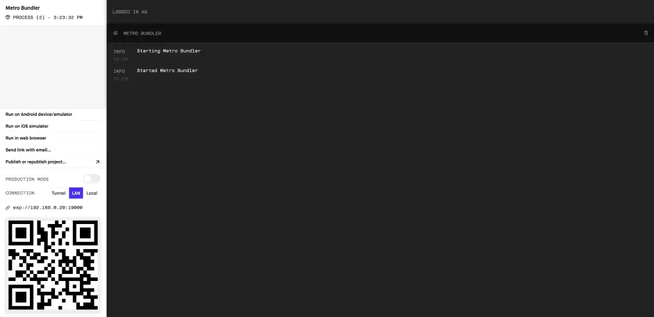

Expo 程序控制台

虽然使用 Expo 已经简化了很多搭建环境的步骤，但可能还是会碰到点问题。视频中老师 Expo CLI 版本为 2.21.2，以及我之前自己安装过的本地版本为 4.13.0，按照视频中的步骤均无法正常运行。后来我本地安装了当下最新的版本 5.4.12 后，流程可以正常的走下去了。

如果还要在手机上预览应用，App 更新过了名称叫 Expo Go，而不是视频中的 Expo Client。安装 App 后，使用时可以通过原生相机扫描二维码，手机将自动打开 Expo Go。

使用模拟器预览会稍稍麻烦点，可以查看 Expo 官方指南来配置相应的模拟器

iOS 模拟器：https://docs.expo.dev/workflow/ios-simulator/

Android 模拟器：https://docs.expo.dev/workflow/android-studio-emulator/

另外有个小坑，安卓模拟器中安卓系统镜像不能选 with google api 的，否则无法正确运行 Expo 项目。

如果可以在实机或模拟器预览初始项目，那么恭喜你，你已经完成上手 RN 开发 50%的工作了～～～

安卓模拟器与 iOS 模拟器

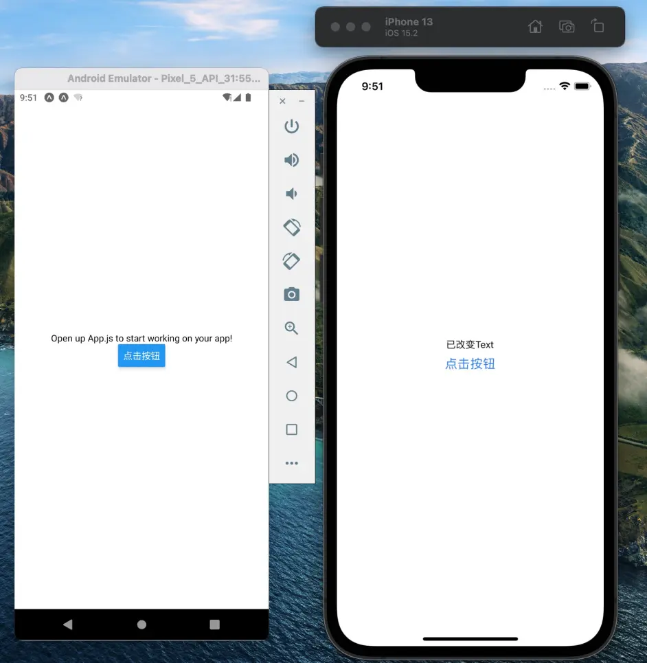

第二章到第五章的内容，比较接近普通 UI 库的使用，对于有经验的开发者，上手难度相对而言比较简单。

### 什么是 React Native

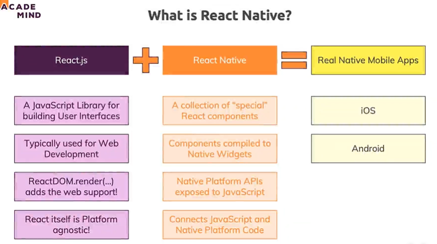

#### 背后发生了什么

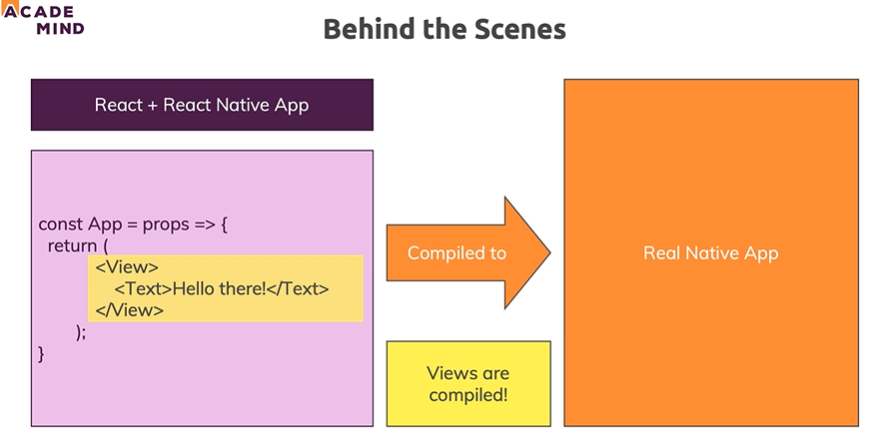

#### 组件转译细节

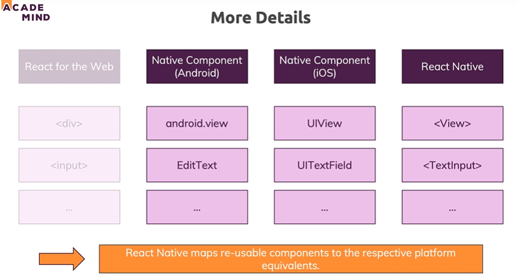

#### JavaScript 逻辑如何运行

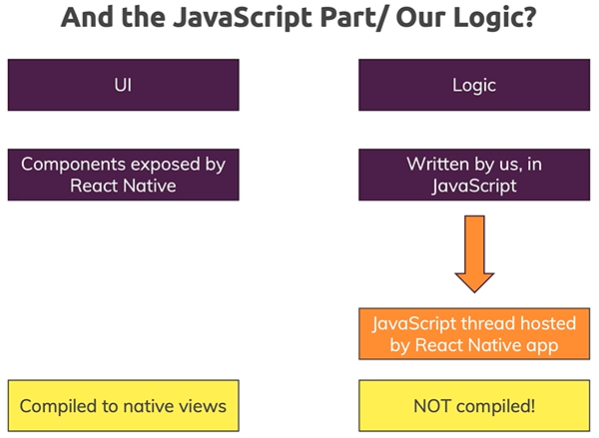

#### JavaScript 如何转译成 Native App

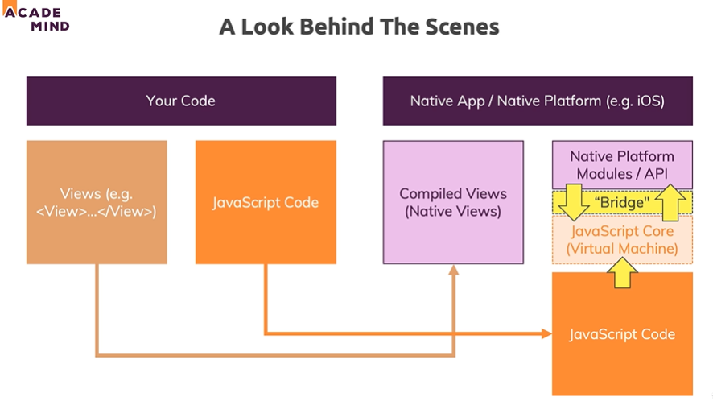

### 使用 Expo 还是 React Native CLI

创建新 React Native App

- Expo CLI/Tool
  - 免费。Third-Party Service (Free!)
  - 管理 App 开发。"Managed App Development"
  - 便捷、简化开发。Lots of Convenience & Utility Features: Simplifies Development
  - 会受限于 Expo 生态系统，无法精细控制原生 App。But:You're limited to the Expo Ecosystem
- React Native CLI
  - 官方支持。
  - 只有基本的开发配置。
  - 不方便，没有工具库。
  - 充分的灵活性: 与任何原生代码集成。

两者可以随时切换。

### Expo 如何运行

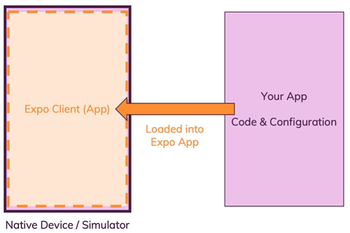

- 可以作为 Expo App 发布
- 可以作为独立 App 发布
- 可以切换回 React Native CLI 开发

创建 React Native App

开发我们的第一款应用

React 原生应用非常困难

### 版本更迭

1. 发布新版本
2. 版本退回
3. 第三方依赖更新
4. Bugs 修复

#### 该不该学 React Native

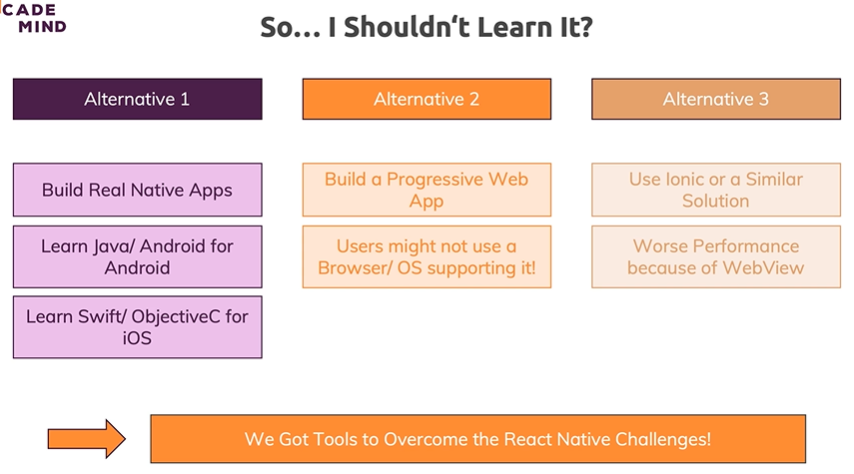

## 第二章：RN 内置基础组件示例、如何编辑样式

第二章的任务，就是熟悉 RN 内部组件的使用，最基础的 7 个组件如下

```javascript
// 容器组件，相当于 <div></div>，
// 但是对于内容超出容器高度的情况是不能滚动的
// 默认使用 flexbox 布局
<View />
// 可滚动的容器组件，
// 一次会渲染所有节点，适合数据不多的滚动
<ScrollView />
// 可滚动的容器组件，
// 懒加载结点，适合长列表
<FlatList />

// 文本组件，负责展示文本。
// 注意在 RN 中，文本必须被 Text 组件包裹
<Text>文本</Text>

// 按钮，按钮的文本通过 title 属性赋值。
// 此外，RN 中点击事件是 onPress 而不是 onClick。
<Button
  onPress={onPressHandler}
  title="按钮"
/>

// 输入框
<TextInput
  onChangeText={onChangeText}
  value={text}
/>

// 图片，本地图片使用 require 引入，网络图片通过 uri 属性引入
<Image source={require('./img/check.png')} />
<Image
  source={{uri: 'https://reactjs.org/logo-og.png'}}
  style={{width: 400, height: 400}
/>
```

还有个和 Web 开发中不同的是，RN 中并不是每个组件都有点击事件，像 Image 和 View 都是没有 onPress 事件的，为了帮这些组件绑定点击事件，需要在包裹在特定的组件中来实现，课程中提到以下四个组件：

```javascript
// 1.透明效果
<TouchableOpacity
  onPress={onPress}

><Text>文本</Text>
></TouchableOpacity>

// 2.高亮
<TouchableHighlight onPress={onPress}>
  <View>
    <Text>文本</Text>
  </View>
</TouchableHighlight>

// 3.原生的反馈
<TouchableNativeFeedback
  onPress={() => {
    setRippleColor(randomHexColor());
    setRippleOverflow(!rippleOverflow);
  }}
  background={TouchableNativeFeedback.Ripple(rippleColor, rippleOverflow)}

><View>
><Text>文本</Text>
></View>
></TouchableNativeFeedback>

// 4.无反馈
<TouchableWithoutFeedback onPress={() => alert('Pressed!')}>
  <MyComponent />
</TouchableWithoutFeedback>;
```

这四种组件的区别就是在点击后的反馈效果。

RN 中书写样式也与传统 Web 开发时不同，比较像 JSS 的做法，通过 StyleSheet Objects，书写类 CSS 的语法，而且自带属性验证，对于不正确的值会抛错

```javascript
// 官方的例子
import React from 'react';
import { StyleSheet, Text, View } from 'react-native';

const App = () => (
  <View style={styles.container}>
    <Text style={styles.title}>React Native</Text>
  </View>
);

const styles = StyleSheet.create({
  container: {
    flex: 1,
    padding: 24,
    backgroundColor: '#eaeaea',
  },
  title: {
    marginTop: 16,
    paddingVertical: 8,
    borderWidth: 4,
    borderColor: '#20232a',
    borderRadius: 6,
    backgroundColor: '#61dafb',
    color: '#20232a',
    textAlign: 'center',
    fontSize: 30,
    fontWeight: 'bold',
  },
});

export default App;
```

## 第三章：调试 RN 程序的方法

第三章讲解了如何调试 RN 程序，有以下两种方法。

第一种，可以在 Metro 控制台查看 console 信息或者报错

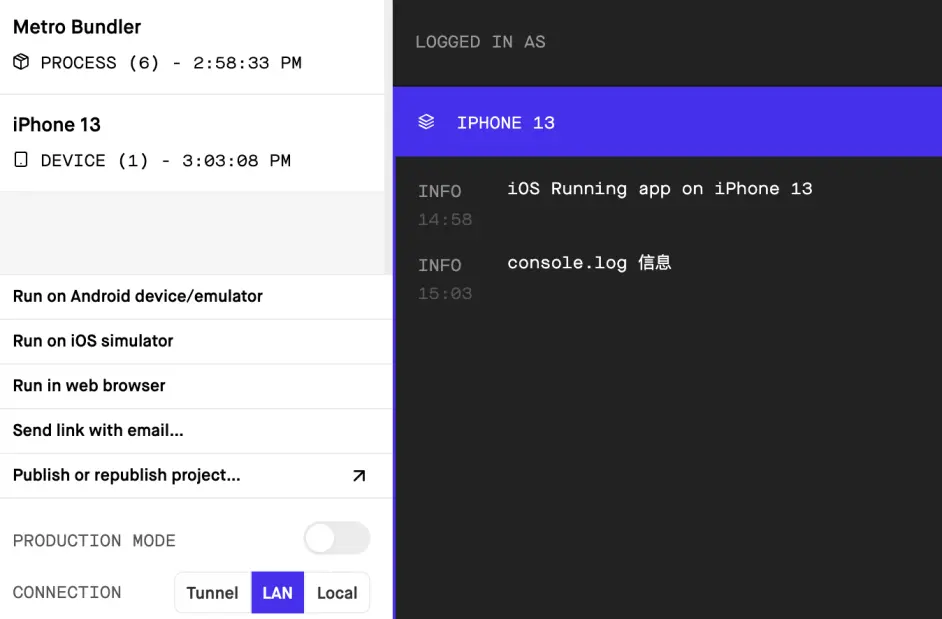

console.log 信息
第二种，如果需要下断点，需要在模拟器的 Expo Go 中的控制台中启用远程调试 JS。安卓模拟器使用快捷键 command+m 打开控制台，iOS 模拟器使用快捷键 command+d。

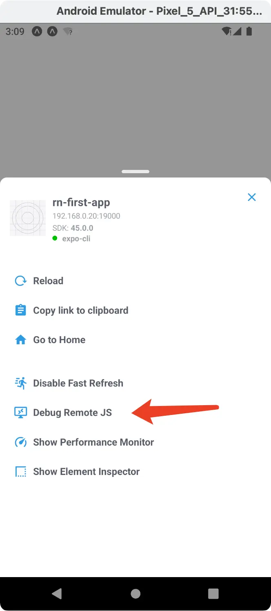

Expo 控制台点击 Debug Remote JS
点击后，浏览器会打开个新页签，新页签页面打开 Developer Tools，接下来就可以像 Web 开发时的方式来打断点了。

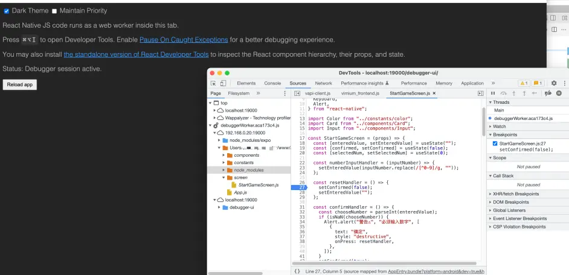

可以直接下断点调试程序
当不需要调试时，同样的方法在 Expo 中打开控制台，关闭远程调试模式。（注意，直接关闭浏览器中的调试页是没用的，还会导致一些意想不到的状况。）

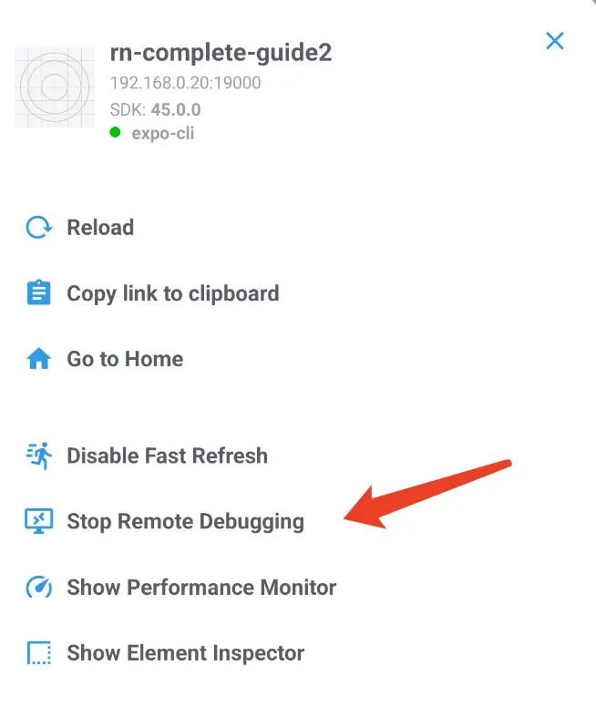

关闭远程调试
除了以上两种最基本的调试方式，视频中还推荐了第三方的调试工具：React Native Debugger。这个工具在 Chrome Developer Tools 的基础上，整合了 react、redux、Apollo Client 的调试插件。

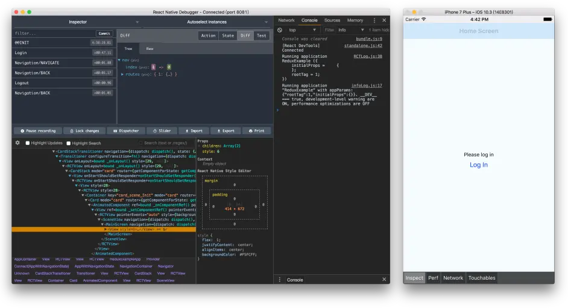

React Native Debugger 官方示意图

## 第四章：加载静态资源、使用第三方 UI 库、以及 IOS 与 Android 在实现某些样式上的差异

第四章以一个猜数字 App 为例子，以项目为目的开发 RN 程序，除了进一步复习组件与样式外，还增加了加载静态资源、键盘控制等方法。

### 安卓与 iOS 系统的样式差异

安卓与 iOS 系统的样式差异，需要开发人员根据各个系统去适配，比如同样给容器增加阴影。在安卓中直接使用 View Style Props 中的 elevation 来实现，而 iOS 中需要使用 ShadowStyleIOS 来实现。

```javascript
const styles = StyleSheet.create({
  card: {
    padding: 20,
    backgroundColor: 'white',
    borderRadius: 10,

    // 安卓实现 View 阴影样式
    elevation: 8,

    // iOS 实现 View 阴影样式
    shadowColor: 'black',
    shadowOffset: { width: 0, height: 2 },
    shadowRadius: 6,
    shadowOpacity: 0.26,
  },
});
```

### 键盘

如何关闭键盘？点击输入框可以弹出键盘，但是如果我们不提交的话，是无法手动关闭键盘的。如果需要关闭键盘，可以通过全局的 Touchable 组件，配合 KeyBoard API 来实现。

```javascript
<TouchableWithoutFeedback onPress={Keyboard.dismiss()}>// ...</TouchableWithoutFeedback>
```

使用 iOS 模拟器时，如果模拟器检测到有外部键盘输入，模拟器中软键盘将不会显示，如果需要打开，需要更改一下模拟器设置 I/O -> Keyboard。

### 警告

通过 RN 提供的 Alert 类，可以实现弹窗功能。

```javascript
Alert.alert(
  'Alert 标题',
  'Alert 内容信息',
  // 按钮组，可以定义按钮样式与回调函数
  [
    {
      text: '取消',
      onPress: () => console.log('Cancel Pressed'),
      style: 'cancel',
    },
    { text: '确认', onPress: () => console.log('OK Pressed') },
  ]
);
```

### 自定义字体

如果需要使用自定义字体，需要安装 expo-font 库

```
expo install expo-font
```

然后在程序入口加载字体资源

```javascript
import { useFonts } from 'expo-font';

// ...
const [loaded] = useFonts({
  Montserrat: require('./assets/fonts/Montserrat.ttf'),
});
// ...
```

### Icons

使用 Icons 同样需要 expo 的介入，@expo/vector-icons 这个库默认已经在初始化 expo 项目时安装好了，使用方法如下

```javascript
import Ionicons from '@expo/vector-icons/Ionicons';

export default function App() {
  return (
    <View style={styles.container}>
      // name 的取值可以去 https://icons.expo.fyi/ 这个网站查
      <Ionicons name='md-checkmark-circle' size={32} color='green' />
    </View>
  );
}
```

### 整合第三方 UI 库

```javascript
// 可以试试 expo 官网指南中提到的几个 UI 库
// https://docs.expo.dev/guides/userinterface/
```

## 第五章：实现程序响应式的一些内容

第五章是对第四章实现的猜数字 APP 的调整，适配程序在小屏、旋转下的正确展示，并根据不同平台设置不同的样式。

### 屏幕

```javascript
import { useWindowDimensions, Dimensions, SafeAreaView } from 'react-native';

// 1
// 获取设备像素信息
// 这里的 height width 是响应式的，会随着屏幕尺寸改变而改变
const { height, width } = useWindowDimensions();

// 2
// 监听屏幕方向变化
Dimensions.addEventListener('change', ({ window, screen }) => {});

// 3
// SafeAreaView 组件提供通用的安全显示区域，防止刘海屏遮挡屏幕内容
const App = () => {
  return (
    <SafeAreaView style={styles.container}>
      <Text>内容</Text>
    </SafeAreaView>
  );
};

const styles = StyleSheet.create({
  container: {
    flex: 1,
  },
});

// 4
// KeyboardAvoidingView
// 可以防止软键盘遮挡输入区
const KeyboardAvoidingComponent = () => {
  return (
    <KeyboardAvoidingView behavior={Platform.OS === 'ios' ? 'padding' : 'height'}>
      <TouchableWithoutFeedback onPress={Keyboard.dismiss}>
        <View>
          <Text>Header</Text>
          <TextInput placeholder='Username' />
          <View>
            <Button title='Submit' onPress={() => null} />
          </View>
        </View>
      </TouchableWithoutFeedback>
    </KeyboardAvoidingView>
  );
};
```

### 检测平台

通过 Platform API 可以获取设备的平台信息

```javascript
import { Platform, StyleSheet } from 'react-native';

// 获取当前操作系统名称
console.log(Platform.OS); // enum('android', 'ios')

// 使用 .select() 方法来获取类似 switch 的功能
const styles = StyleSheet.create({
  container: {
    flex: 1,
    ...Platform.select({
      android: {
        backgroundColor: 'green',
      },
      ios: {
        backgroundColor: 'red',
      },
      default: {
        // other platforms, web for example
        backgroundColor: 'blue',
      },
    }),
  },
});
```

另外 RN 提供了 Platform-specific extensions 的特性，帮助我针对不同平台进行个性化定制。当文件后缀.ios. 或 .android.，引入该文件时 RN 会自动根据不同平台加载不同代码。

对于以下两个文件

```javascript
BigButton.ios.js;
BigButton.android.js;
```

RN 会自动根据平台引入对应的文件

```javascript
import BigButton from './BigButton';
```

### 旋转

expo 初始化的项目根目录，会有 app.json 文件，其中的 expo.orientation 属性可以锁定 App 的旋转

```javascript
{
  "expo": {
    // ...
    // 一共有三种取值 default, portrait, landscape
    // 默认为 default， 不限制转向
    // portrait 时，限制程序为纵向
    // landscape 时，限制程序为横向
    "orientation": "portrait",
    // ...
  }
}
```

如果需要运行时更改屏幕的方向，可以使用 expo-screen-orientation 这个库来实现。

## 第六章：导航

第六章的内容为导航，通过库 React Navigation 来实现的，视频中第六章使用的是版本 3，在第十五章附加章中，老师又介绍了版本 5 与版本 3 的差异，两个版本的使用方法差异不小，初学时可以跟着第六章的步骤，使用版本 3 进行学习。

RN 中导航与 Web 中导航最大区别，就是没有 URL 这个概念了，所以配置路由的方法与 Web 中根据 URL 映射组件的方法略有不同。

React Navigation 将路由的类型分为四种，分别为 Stack、BottomTab、Drawer、Switch。

BottomTab 类型，顾名思义就是一般 App 首页底部的按钮对应的页面，Drawer 是侧栏弹出的菜单对应的页面。Swtich 提供类似路由守卫的功能，可以用来区分未登录与已登录的页面，其余所有的页面，都可放入 Stack 类型中。

创建对应路由类型的方法如下

```javascript
import {
  createStackNavigator,
  createAppContainer,
  createBottomTabNavigator,
  createDrawerNavigator,
  createSwitchNavigator,
} from 'react-navigation';

// Stack
const StackNavigator = createStackNavigator({
  Xxx: XxxScreen,
  // ...
});

// BottomTab
const BottomTabNavigator = createBottomTabNavigator({
  Xxx: XxxScreen,
  Xxx2: {
    screen: Xxx2Screen,
    navigationOptions: {
      // 通过这个属性设置 Tab 的 icon
      tabBarIcon: tabInfo => <Ionicons name='ios-restaurant' size={25} />,
    },
  },
  // ...
});

// Drawer
const DrawerNavigator = createDrawerNavigator({
  Xxx: XxxScreen,
  // ...
});

// Switch
const SwitchNavigator = createSwitchNavigator({
  Main: BottomTabNavigator,
  Auth: AuthScreen,
});

// 最后通过 createAppContainer 方法创建导航入口
export default createAppContainer(SwitchNavigator);
```

React Navigation 中还有有个很重要的概念就是 Screen component，被配置进上述四种路由类型中的组件，会被定义为 Screen component，Screen component 的 props 会自动传入 navigation 属性，用来实现路由相关功能。

React Navigation 这个路由库与 Web 中的路由库不同，除了提供路由相关逻辑外，还包含了 UI 的实现，比如创建了 BottomTab 类型的导航后，在相应的页面会自动出现底部 Tabs 区域。

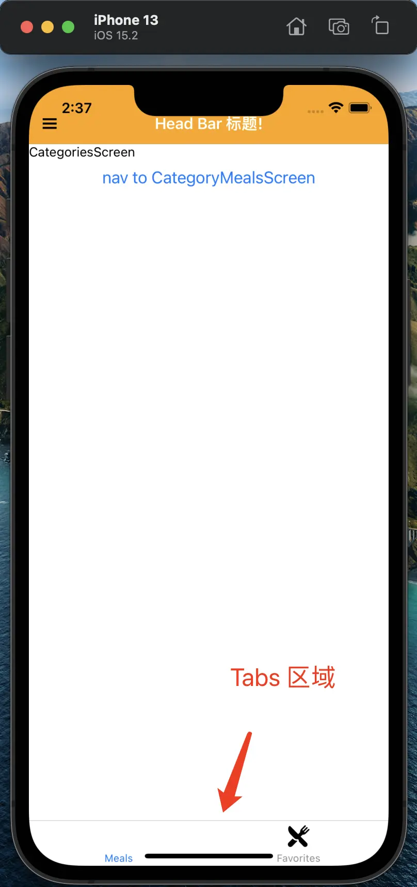

Tabs 区域自动加载
如何导航去其他页面？通过 props.navigation.navigate 方法实现

```javascript
class HomeScreen extends React.Component {
  render() {
    const { navigate } = this.props.navigation;

    return (
      <View>
        <Text>This is the home screen of the app</Text>
        <Button
          // 第一个参数是目的路由的名称，就是创建导航类型时，自己定义的名称
          // 第二个参数是传递的参数 params
          // 在目标页面，通过 props.navigation.getParam('name') 获取参数值
          onPress={() => navigate('Profile', { name: 'Brent' })}
          title="Go to Brent's profile"
        />
      </View>
    );
  }
}
```

React Navigation 甚至还提供了 Header Bar 的配置功能，可以在组件的 navigationOptions 属性上添加相应的配置，来自定义 Header Bar。

```javascript
ScreenComponent.navigationOptions = navData => ({
  // HeaderBar 标题
  headerTitle: 'HeaderBar 标题!',
  // HeaderBar 样式
  headerStyle: {
    backgroundColor: 'orange',
  },
  // HeaderBar 文本颜色
  headerTintColor: 'white',
});
```

效果如下（⚠️ 注意：header bar 的修改，需要 reload 程序后才能生效）

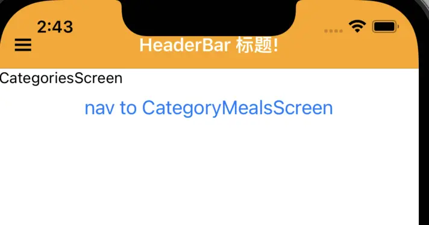

HeaderBar
添加 header bar 除了直接配置组件的静态属性 navigationOptions，还可以在创建导航时，统一配置。

```javascript
// 官方例子，createStackNavigator 方法第二个参数来同一配置 NavigationOptions
const HomeStack = createStackNavigator(
  { A },
  {
    // 组件的 .navigationOptions 配置可以覆盖这里的配置
    defaultNavigationOptions: {
      title: 'Welcome',
    },
  }
);
```

通过 headerRight、headerLeft 两个属性，还可以在 header bar 上还可以增加按钮。这两个属性直接接收 React Element。但是由于各个平台和机型的兼容性，如果让我们自己来书写组件，可能除了业务逻辑外，还要适配各个机型，比较麻烦。所以一般使用第三方库来实现此功能，视频中使用的是 react-navigation-header-buttons 这个包，部分代码如下

```javascript
import { Ionicons } from '@expo/vector-icons';
import { HeaderButtons, Item } from 'react-navigation-header-buttons';
// ...
const CustomHeaderButton = props => {
  return <HeaderButton {...props} IconComponent={Ionicons} iconSize={23} />;
};

CategoriesScreen.navigationOptions = navData => ({
  headerTitle: 'HeaderBar 标题!',
  headerStyle: {
    backgroundColor: 'orange',
  },
  headerTintColor: 'white',
  headerLeft: (
    <HeaderButtons HeaderButtonComponent={CustomHeaderButton}>
      <Item
        title='Favorite'
        iconName='ios-menu'
        onPress={() => {
          navData.navigation.toggleDrawer();
        }}
      />
    </HeaderButtons>
  ),
});
```

效果如下

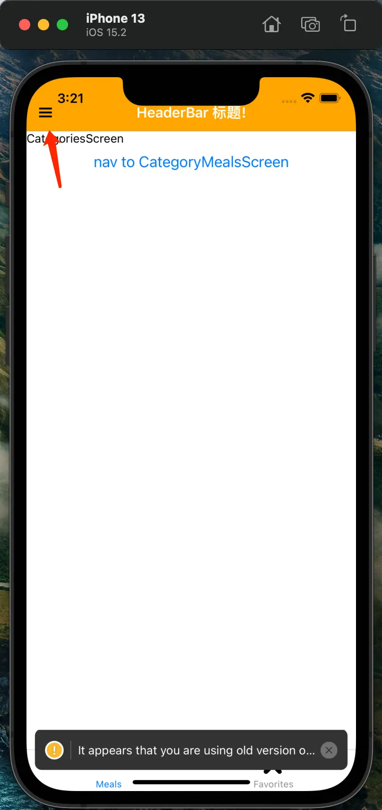

headerLeft
使用 header bar 中的按钮有一点需要注意，就是组件传值问题。按钮组件与我们页面组件的数据是不通的，那我们如何在两个组件中传值呢？视频中用的方法我个人认为有些 hack，就是通过 navigation.setParams 设置后，另一边使用 navigation.getParam 拿值。

导航的部分差不多就是这点，还是比较重要的，与 Web 开发中差别比较大，可能需要多关注多熟悉一下。

## 第七章：状态管理（介绍 Redux）

第七章、第八章、第九章属于复习类型的章节，如果需要复习 Redux、Javascript 基础、React 基础的话，可以选择性观看。

## 第八章：实战 ShopApp （复习 Javascript 知识）

## 第九章：处理用户输入 （讲解 React 基础知识）

## 第十章：Http

第十章和第十一章可以算作一类，都是讲与服务端交互的。课程中使用了 Firebase 来做 mock 的服务端，需要注册 Firebase 来开启，没有条件的同学不使用，问题也不大。

第十章说 RN 中的 HTTP 请求，发送接收请求基本上与 Web 中没有区别。

### 导航增加监听

可以使用 navigation.addListener('willFocus', handler) 来更新页面数据，这样就可以在页面重新切换回来时加载数据。

### 加载指示器

可以使用 RN 中 ActivityIndicator 组件


ActivityIndicator 组件效果

### 下拉刷新

还记得 RN 的 FlatList 组件吗，就是用来展示长列表的，可以使用 onRefresh 属性定义下拉触发的方法，refreshing 属性定义当前是否是加载状态。

## 第十一章：鉴权、存储本地数据

第十一章讲解了鉴权的方法，鉴权使用的是 Token 方案。视频中使用服务端的还是 Firebase 的服务，对于 RN 端，需要在获取 Token 后存到本地，这时你可能就发现问题了，在 Web 应用中，我们都是将 Token 存在 localStorage 中，而 RN 中没有这个概念，取而代之的是 AsyncStorage 模块。（⚠️ 注意：咪咪使用的的 RN 版本是 0.69，这个模块已经是 Deprecated 状态了，官方建议使用其他社区包来代替）

```javascript
// 官方例子

import { AsyncStorage } from 'react-native';

// 存数据
_storeData = async () => {
  try {
    await AsyncStorage.setItem('@MySuperStore:key', 'I like to save it.');
  } catch (error) {
    // Error saving data
  }
};

// 取数据
_retrieveData = async () => {
  try {
    const value = await AsyncStorage.getItem('TASKS');
    if (value !== null) {
      // We have data!!
      console.log(value);
    }
  } catch (error) {
    // Error retrieving data
  }
};
```

接下来就要开始学习原生 App 的功能了，目前为止的学习过程中，我们大多还是依赖 RN 本身提供的能力，使用方法与 Web 开发时区别不是很大。而使用原生模块则不然，可能还需要修改安卓项目或 iOS 项目的配置，对刚刚入门的我们可能门槛还太高。这时使用 Expo 工作流的优势就显示出来了，Expo 大大降低了安装和使用原生模块的门槛。

## 第十二章：使用原生功能

第十二章教了我们如何在 Expo 工作流下，使用原生模块。

### 权限

大多数原生模块都需要用户授权后才能使用，所以在使用原生的功能前，都需要获取权限状态，如果没有相应权限，需要向用户请求权限。

视频中的 Expo SDK 还比较早，所以使用统一的权限管理包 expo-permissions 来获取权限。而 Expo SDK 38 之后，获取权限不再采用视频中方法。Permissions 模块被整合到各个功能模块自己的功能中去了。

### 选择图片

选择图片通过 expo-ImagePicker 来实现，首先安装依赖（注意使用的是 expo install）

```
expo install expo-image-picker
```

安装完成后，在文件中引入模块

```
import * as ImagePicker from 'expo-image-picker';
```

首先获取权限。没有权限但调用方法时，安卓会弹出授权框让用户确认，而 iOS 不会，需要手动调用授权功能让用户确认。

```javascript
// ...

const [status, requestPermission] = ImagePicker.useCameraPermissions();

const pickImage = async () => {
  // status.granted 为当前是否有相机权限
  if (!status.granted) {
    // 没有权限就要请求权限
    await requestPermission();
  }
};

// ...
```

获取权限后，启动相机

```javascript
const result = await ImagePicker.launchCameraAsync();
```

有两点需要注意

第一：iOS 模拟器是无法打开相机的，调用不会有任何反应，而安卓模拟器会打开个模拟相机来拍摄。

第二：ImagePicker.launchCameraAsync 方法返回的的图像地址是临时的。

除了通过相机拍照获取图片，还可以通过相册来选择图片

```javascript
// ImagePicker.launchImageLibraryAsync 方法还可以接收一个对象，来配置选中的图片
let result = await ImagePicker.launchImageLibraryAsync({
  mediaTypes: ImagePicker.MediaTypeOptions.All,
  allowsEditing: true,
  aspect: [4, 3],
  quality: 1,
});
```

视频录制时间比较早，所以选择相册本来是不需要权限的，但是苹果公司在 iOS 10 开始，对相册也有了权限控制，需要通过 ImagePicker.useMediaLibraryPermissions 来获取并请求相册权限。

PS：M1 芯片的机器，iOS 模拟器在选择图片时会卡住，安卓模拟器和 iPhone 实机正常。

### 存储图片到本地

ImagePicker.launchCameraAsync 方法返回的的图像地址是临时的，如果需要保存到本地，需要使用 FileSystem 模块帮忙。

安装 expo-file-system 库来使用 FileSystem 模块

```
expo install expo-file-system
```

引入模块

```javascript
import * as FileSystem from 'expo-file-system';
```

每个 App 只允许在指定的文件夹下写入文件，通过一下属性获取该文件夹 uri

```javascript
// 获取 App 可写的文件夹 uri，以 file:// 开头
console.log(FileSystem.documentDirectory);
```

通过“剪切”文件，将临时图片移动到 App 存储文件夹中

```javascript
FileSystem.moveAsync({
  from: 'file://xxx1',
  to: 'file://xxx2',
});
```

### 更完整的存储系统

除了 FileSystem 模块，还可以使用 expo-sqlite 包来创建并使用本地数据库。

安装

```
expo install expo-sqlite
```

示例

```javascript
// 引入模块
import * as SQLite from 'expo-sqlite';

// 打开/创建数据库
// 数据库地址 ${FileSystem.documentDirectory}/SQLite/${name}
const db = SQLite.openDatabase('rn-demo');

// 初始化数据库
export const initDB = () => {
  return new Promise((res, rej) => {
    // 执行事务
    db.transaction(tx => {
      // 执行sql
      tx.executeSql(
        `CREATE TABLE IF NOT EXISTS users (id INTEGER PRIMARY KEY NOT NULL, name VARCHAR)`,
        [],
        () => res(),
        (_, err) => rej(err)
      );
    });
  });
};

// 增加用户
export const insertUser = () => {
  return new Promise((res, rej) => {
    db.transaction(tx => {
      tx.executeSql(
        `INSERT INTO users (name) VALUES (?)`,
        ['lyf'],
        (_, ret) => {
          res(ret);
        },
        (_, err) => {
          rej(err);
        }
      );
    });
  });
};

// 获取用户列表
export const getUser = () => {
  return new Promise((res, rej) => {
    db.transaction(tx => {
      tx.executeSql(
        `SELECT * FROM users`,
        [],
        (_, ret) => {
          res(ret);
        },
        (_, err) => {
          rej(err);
        }
      );
    });
  });
};
```

### 位置功能与地图

这两个功能可以放在一起，视频中老师讲解时，还配合了 Google Geocoding API，同 Firebase 一样，无法使用的同学也不用担心，我们主要还是学习 App 端的一些方法。

位置功能使用 expo-location 包来实现，同样首先安装包

```
expo install expo-location
```

获取用户位置信息

```javascript
// 引入模块
import * as Location from 'expo-location';

const handleGetCurrentLocationBtnClick = async () => {
  // 请求位置权限
  let { status } = await Location.requestForegroundPermissionsAsync();
  if (status !== 'granted') {
    setErrorMsg('获取位置权限被拒绝！');
    return;
  }

  // 获取设备当前位置信息
  let location = await Location.getCurrentPositionAsync({});
  console.log(location);
};
```

地图展示需要使用一个叫 react-native-maps 的包，也是先安装包（注意这个不用 expo install 了）

```
npm i react-native-maps
```

使用示意

```javascript
import React from 'react';
// 还记得 RN 中这些组件都有什么用吗?
import { View, Text, StyleSheet, Button, Dimensions } from 'react-native';
// 引入组件
import MapView from 'react-native-maps';

const MapViewContainer = props => {
  return (
    <View>
      <MapView
        style={styles.map}
        // 初始定位
        initialRegion={{
          // 经纬度值，可以通过
          // 获取设备位置信息(Location.getCurrentPositionAsync)
          // 的返回值 location.coords 中获得
          latitude: 37.78825, // location.coords.latitude
          longitude: -122.4324, // location.coords.longitude

          // 下列两个属性是经纬度缩放比例
          latitudeDelta: 0.0922,
          longitudeDelta: 0.0421,
        }}
      />
    </View>
  );
};

const styles = StyleSheet.create({
  map: {
    width: Dimensions.get('window').width,
    height: 300,
  },
});

export default MapViewContainer;
```

第十二章原生模块到这里就结束了。

## 第十三章：不使用 Expo，使用 React Native CLI 的工作流

第十三章提到了工作流的概念，一共有三种工作流模式：Expo Managed Workflow、Expo Bare Workflow、React Native CLI，上手难度依次递增。我们目前为止使用的工作流模式就是第一种——Expo Managed Workflow。

通过上一章原生模块的学习我们似乎有个感觉，就是原生模块没有咪咪在文章开头讲的那么难，无论需要使用什么原生功能，只要 expo install 一个相关库就可以开始开发了，就像 Web 中普通的工具库一样。但是这种便利是有代价的，如果一个功能 Expo 本身没有提供，那么我们是无法自行添加的，自己导入相关功能包也不行。

相比其他两种工作流，这就是 Expo Managed Workflow 的局限性。当然对于刚踏进一只脚进 RN 开发的我们，这个问题可以暂时放一放。（如果需要跟着视频手敲一遍非 Expo 工作流下，使用原生模块的方案，首先还要通过 React Native CLI 初始化项目。这个环境搭建的过程也很痛苦。）

```javascript
// React Native CLI 环境搭建官方文档地址：https://reactnative.dev/docs/environment-setup
```

先来简单说说 React Native CLI 这种方式吧，视频中的老师使用选择图片这个功能做示例。

首先安装核心库 react-native-image-picker：

```bash
yarn add react-native-image-picker

# RN >= 0.60，咪咪写这篇文章时，RN 最新稳定版是 0.69

cd ios && pod install

# RN < 0.60，视频中的方法

react-native link react-native-image-picker
```

react-native link 的作用就是 RN 帮我们做了 native 的一些配置。

pod 命令由 CocoaPods 提供，CocoaPods 是用 Ruby 写的 Swift 和 Objective-C 的包管理软件。如果你做过 React Native CLI 的环境搭建，你电脑上已经安装了这个软件。

原生模块安装结束后，接下来就是配置权限，需要分别在安卓与 iOS 项目的配置文件中添加相应权限：

安卓的配置权限文件路径：/android/app/src/main/AndroidManifest.xml

```javascript
<uses-permission android:name="android.permission.CAMERA" />
<uses-permission android:name="android.permission.READ_EXTERNAL_STORAGE" />
<uses-permission android:name="android.permission.WRITE_EXTERNAL_STORAGE" />
```

iOS 的配置权限文件路径：/ios/AppWithoutExpo/Info.plist

```javascript
<key>NSPhotoLibraryUsageDescription</key>
<string>Give $(PRODUCT_NAME) permission to save photos</string>
<key>NSCameraUsageDescription</key>
<string>Give $(PRODUCT_NAME) permission to access your camera</string>
<key>NSMicrophoneUsageDescription</key>
<string>Give $(PRODUCT_NAME) permission to use your microphone</string>
```

配置结束后，接下来我们就可以在项目中引入并使用了

```javascript
import { launchCamera, launchImageLibrary } from 'react-native-image-picker';
```

相比 Expo Managed Workflow 中，我们只要安装 expo-image-picker 这个库就可以了。

三种工作流中，还有一种工作流 Expo Bare Workflow。这种方式介于 Expo Managed Workflow 与 React Native CLI 之间，还是以 React Native CLI 的文件夹格式为主，但是简化了引入原生模块的步骤。

初始化 Expo Bare Workflow 项目的方法有两种，第一种是在 expo init 项目的时候，template 选项选择 "bare-minimum"（之前我们选择的是 "blank"）。第二种方法就是在 Expo Managed Workflow 项目下，运行 expo eject 命令（注意这个过程是不可逆的）。

总之 Expo Bare Workflow 这个方式可以理解为，React Native CLI 的工作流 + expo 的引入原生模块方法。

咪咪认为 RN 的难点就是在跟环境、配置相关的功能上。系统不一样、模拟器和实机也不同，而且还会有很多奇奇怪怪的问题，比如 Apple M1 下的 BUG 。这也是 RN 不能像普通的 UI 库一样，开箱即用。

## 第十四章：发布 App

第十四章讲解了发布的流程，发布流程是以 Expo Managed Workflow 项目为基础的。

在项目根目录运行，即可发布程序（需要有 Expo 账号）

```
expo publish
```

在 app.json 中，可以配置 App 相关信息

expo.name：App 名称。

expo.slug：发布后的 URL。e.g.expo.dev/@project-owner/myAppName project

expo.assetBundlePatterns：需要打包进 App 的静态资源目录。

expo.updates.fallbackToCacheTimeout：更新策略配置。

expo.splash：配置加载屏。

发布很复杂，其实还是需要自己亲身经历过才能理解个大概，这里只是跟着老师稍微过一遍一些基础的注意事项。等之后自己需要发布 App 时，还是要跟着官方指南上的要求，来一项项检查并更改。

第十五章开始都是附加章节，老师后来录制的。

## 第十五章：新增章节，导航库新版本与之前使用版本的差异

第十五章讲解了导航库 React Navigation@5 的一些知识，我们在第六章学习时使用的是 3 号大版本。

首先安装时，包名改掉了，现在叫 @react-navigation/native。

```bash
npm install @react-navigation/native@5

# 或

yarn add @react-navigation/native@5
```

与版本 3 相比，版本 5 由之前是基于注册的，现在是基于组件声明的。（新版本下配置路由的方式更接近 Web 开发中的方式）

```javascript
// 官方示例
// App.js

import * as React from 'react';
import { View, Text } from 'react-native';
import { NavigationContainer } from '@react-navigation/native';
import { createStackNavigator } from '@react-navigation/stack';

function HomeScreen() {
  return (
    <View style={{ flex: 1, alignItems: 'center', justifyContent: 'center' }}>
      <Text>Home Screen</Text>
    </View>
  );
}

const Stack = createStackNavigator();

function App() {
  return (
    <NavigationContainer>
      <Stack.Navigator>
        <Stack.Screen name='Home' component={HomeScreen} />
      </Stack.Navigator>
    </NavigationContainer>
  );
}

export default App;
```

由于现在采用声明式方式来配置路由，所以没有 SwitchNavigator 了。现在可以在组件中获取权限，并通过逻辑处理来决定是否展示组件。

版本 5 中组件的 navigationOptions 由 props.options 代替，从父组件传入；获取路由参数方法，getParams 方法没有了，使用 props.route.params.xxx 代替；设置路由参数方法也改了，setParams 变成 setOptions。

除去最后两章节的复习章，第十六章就算是最后一章了。这一章同样也是附加章节，老师补充了 App 通知这块的内容。

## 第十六章：新增章节，使用 App 通知

App 中的通知分为两类，本地通知与推送通知。本地通知类似于 Web 中的 alert，常见的应用场景就是各类 Reminder APP。推送通知与本地通知不同，是由服务器或其他用户“触发”的，常见应用就是各类聊天 App。

要使用本地通知比较简单，首先安装相关 Expo 依赖

```
expo install expo-notifications
```

还记得使用原生模块第一件事是什么吗？没错，获取权限

```javascript
import React, { useEffect } from 'react';
import { View, Text, StyleSheet, Button, SafeAreaView } from 'react-native';

import * as Notifications from 'expo-notifications';

// 获取当前通知权限信息
async function allowsNotificationsAsync() {
  const settings = await Notifications.getPermissionsAsync();
  return settings.granted || settings.ios?.status === Notifications.IosAuthorizationStatus.PROVISIONAL;
}

// 请求通知权限
async function requestPermissionsAsync() {
  return await Notifications.requestPermissionsAsync({
    ios: {
      allowAlert: true,
      allowBadge: true,
      allowSound: true,
      allowAnnouncements: true,
    },
  });
}

// Screen
const NotificationScreen = props => {
  useEffect(() => {
    allowsNotificationsAsync().then(res => {
      if (!res) {
        requestPermissionsAsync();
      }
    });
  }, []);

  return (
    <SafeAreaView>
      <Text>NotificationScreen</Text>
    </SafeAreaView>
  );
};

export default NotificationScreen;
```

视频中老师说安卓需要在 app.json 中进行相应配置，但是 Expo SDK 版本可能更新过了，咪咪在 SDK45 下并没有配置也可以直接使用。iOS 系统根据上述代码获取权限后即可调用通知模块。

获取权限后，就可以安排一个通知了。注意这里是安排，并不是发送。调用方法后，并不会立刻发送通知

```javascript
const triggerNotificationHandler = () => {
  Notifications.scheduleNotificationAsync({
    content: {
      title: '一个通知',
      body: '我是通知body',
    },
    trigger: {
      // 3 秒后通知
      seconds: 3,
    },
  });
};
```

触发通知后需要把 App 切换到后台状态，App 在前台时通知栏不会弹出。


安卓通知栏
在 App 中，可以分别在前台和后台运行时，对通知进行监听

```javascript
import * as Notifications from 'expo-notifications';

// ...

useEffect(() => {
  // 在后台监听通知，用户点击通知后，才会触发回掉函数
  const backSubscription = Notifications.addNotificationResponseReceivedListener(response => {
    console.log('backSubscription ', response);
  });

  // 前台监听通知事件
  const foreheadSubscription = Notifications.addNotificationReceivedListener(notification => {
    console.log('foreheadSubscription ', notification);
  });
  return () => {
    backSubscription.remove();
    foreheadSubscription.remove();
  };
}, []);

// ...
```

本地通知如上所述，那如何实现推送通知？考虑到安全问题，作为开发者，我们不能直接发送消息给用户，使用 Google 和 Apple 的推送服务，通过他们的服务器发送消息给用户。

视频演示了使用 Expo 的服务端来推送消息，也是需要注册——获取 Token——调用推送消息接口，开发时可以使用官方提供的 Tool Web（https://expo.dev/notifications）来模拟推送消息。
