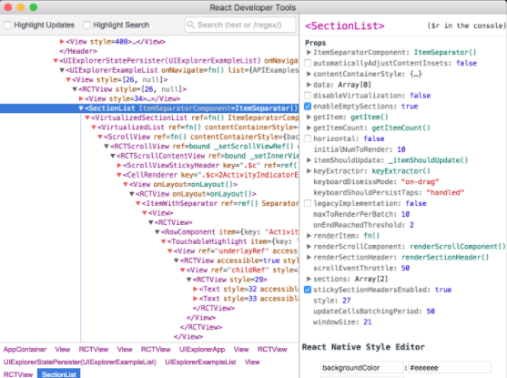
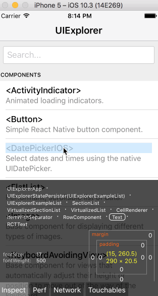

## 环境配置

### 创建新项目

```
npx react-native init AwesomeProject
```

### 编译并运行 React Native 应用

确保你先运行了模拟器或者连接了真机，然后在你的项目目录中运行`yarn android`或者`yarn react-native run-android`：

```jsx
cd AwesomeProjectyarn android# 或者yarn react-native run-android
```

Copy

此命令会对项目的原生部分进行编译，同时在另外一个命令行中启动`Metro`服务对 js 代码进行实时打包处理（类似 webpack）。`Metro`服务也可以使用`yarn start`命令单独启动。

如果配置没有问题，你应该可以看到应用自动安装到设备上并开始运行。注意第一次运行时需要下载大量编译依赖，耗时可能数十分钟。此过程`严重依赖稳定的代理软件`，否则将频繁遭遇链接超时和断开，导致无法运行。

也可以尝试阿里云提供的[maven 镜像](https://help.aliyun.com/document_detail/102512.html?spm=a2c40.aliyun_maven_repo.0.0.361865e90r2x4b)，将`android/build.gradle`中的`jcenter()`和`google()`分别替换为`maven { url 'https://maven.aliyun.com/repository/jcenter' }`和`maven { url 'https://maven.aliyun.com/repository/google' }`（注意有多处需要替换）。

`npx react-native run-android`只是运行应用的方式之一。你也可以在 Android Studio 中直接运行应用。

> [NativeModule: AsyncStorage is null, with @RNC/AsyncStorage](https://stackoverflow.com/questions/56029007/nativemodule-asyncstorage-is-null-with-rnc-asyncstorage)
>
> ```
> run npm start --reset-cache
> ```

## 打包发布

### 生成签名密钥

```
./keytool.exe -genkeypair -v -storetype PKCS12 -keystore d:/my-release-key.keystore -alias my-key-alias -keyalg RSA -keysize 2048 -validity 1000
```

--alias 参数后面的别名是你将来为应用签名时所需要用到的，所以记得记录这个别名。

编辑`~/.gradle/gradle.properties`（全局配置，对所有项目有效）或是`项目目录/android/gradle.properties`（项目配置，只对所在项目有效）。

```
MYAPP_RELEASE_STORE_FILE=my-release-key.keystore
MYAPP_RELEASE_KEY_ALIAS=my-key-alias
MYAPP_RELEASE_STORE_PASSWORD=*****
MYAPP_RELEASE_KEY_PASSWORD=*****

# 设置代理，否则部分资源会请求失败！
systemProp.http.proxyHost=127.0.0.1
systemProp.http.proxyPort=1081
systemProp.https.proxyHost=127.0.0.1
systemProp.https.proxyPort=1081
```

编辑你项目目录下的`android/app/build.gradle`，添加如下的签名配置：

```
android {
    ...
    defaultConfig { ... }
    signingConfigs {
        release {
            if (project.hasProperty('MYAPP_RELEASE_STORE_FILE')) {
                storeFile file(MYAPP_RELEASE_STORE_FILE)
                storePassword MYAPP_RELEASE_STORE_PASSWORD
                keyAlias MYAPP_RELEASE_KEY_ALIAS
                keyPassword MYAPP_RELEASE_KEY_PASSWORD
            }
        }
    }
    buildTypes {
        release {
            ...
            signingConfig signingConfigs.release
        }
    }
}
```


```
cd android
./gradlew assembleRelease
```

生成的 APK 文件位于`android/app/build/outputs/apk/release/app-release.apk`

在把发行版本提交到 Play Store 之前，你应该做一次最终测试。输入以下命令可以在设备上安装发行版本：

```sh
$ npx react-native run-android --variant=release

yarn android --variant=release
```

注意`--variant=release`参数只能在你完成了上面的签名配置之后才可以使用。


### 生成发行 AAB 包

```
cd android
./gradlew bundleRelease
```

生成的 AAB 文件位于`android/app/build/outputs/bundle/release/app-release.aab`


## React 基础

```jsx
import React, {useState, Component} from 'react';
import {View, Text, Image, ScrollView, TextInput, Button} from 'react-native';

const Cat = props => {
  const [isHungry, setIsHungry] = useState(true);

  return (
    <View>
      <Text>
        I am {props.name}, and I am {isHungry ? 'hungry' : 'full'}!
      </Text>
      <Button
        onPress={() => {
          setIsHungry(false);
        }}
        disabled={!isHungry}
        title={isHungry ? 'Pour me some milk, please!' : 'Thank you!'}
      />
    </View>
  );
};

class Dog extends Component {
  state2 = {what: 'DOG!'};
  constructor(props) {
    super(props);
    this.state = {isHungry: true};
  }

  render() {
    return (
      <>
        <Text>DOG!!! {this.state2.what}</Text>
        <Text>
          I am {this.props.name}, and I am
          {this.state.isHungry ? ' hungry' : ' full'}!
        </Text>
        <Button
          onPress={() => {
            this.setState({isHungry: false});
          }}
          disabled={!this.state.isHungry}
          title={
            this.state.isHungry ? 'Pour me some meat, please!' : 'Thank you!'
          }
        />
      </>
    );
  }
}

const CatApp = () => {
  return (
    <View>
      <Image
        source={{uri: 'https://reactnative.dev/docs/assets/p_cat1.png'}}
        style={{width: 200, height: 200}}
      />
      <Text>Hello, I am your cat!</Text>
    </View>
  );
};

const Cafe = () => {
  return (
    <View>
      <Cat name="Maru" />
      <Cat name="Jellylorum" />
      <Dog name="Spot" />
      <CatApp />
    </View>
  );
};

const App = () => {
  return (
    <ScrollView>
      <Text>Some text</Text>
      <View>
        <Text>Some more text</Text>
        <Image
          source={{
            uri: 'https://reactnative.dev/docs/assets/p_cat2.png',
          }}
          style={{width: 200, height: 200}}
        />
      </View>
      <TextInput
        style={{
          height: 40,
          borderColor: 'gray',
          borderWidth: 1,
        }}
        defaultValue="You can type in me"
      />
      <Cafe />
    </ScrollView>
  );
};

export default App;

```

注意到上面的`<>`和`</>`了吗？ 这一对 JSX 标签称为[Fragments（片段）](https://zh-hans.reactjs.org/docs/fragments.html)。由于 JSX 的语法要求根元素必须为单个元素，如果我们需要在根节点处并列多个元素，在此前不得不额外套一个没有实际用处的`View`。但有了 Fragment 后就不需要引入额外的容器视图了。

### [处理文本输入](https://reactnative.cn/docs/next/handling-text-input)

### [使用长列表](https://reactnative.cn/docs/next/using-a-listview)

React Native 提供了几个适用于展示长列表数据的组件，一般而言我们会选用[FlatList](https://reactnative.cn/docs/next/flatlist)或是[SectionList](https://reactnative.cn/docs/next/sectionlist)。

`FlatList`组件用于显示一个垂直的滚动列表，其中的元素之间结构近似而仅数据不同。

`FlatList`更适于长列表数据，且元素个数可以增删。和[`ScrollView`](https://reactnative.cn/docs/next/using-a-scrollview)不同的是，`FlatList`并不立即渲染所有元素，而是优先渲染屏幕上可见的元素。

`FlatList`组件必须的两个属性是`data`和`renderItem`。`data`是列表的数据源，而`renderItem`则从数据源中逐个解析数据，然后返回一个设定好格式的组件来渲染。

```jsx
import React from 'react';
import { FlatList, StyleSheet, Text, View } from 'react-native';

const styles = StyleSheet.create({
  container: {
   flex: 1,
   paddingTop: 22
  },
  item: {
    padding: 10,
    fontSize: 18,
    height: 44,
  },
});

const FlatListBasics = () => {
  return (
    <View style={styles.container}>
      <FlatList
        data={[
          {key: 'Devin'},
          {key: 'Dan'},
          {key: 'Dominic'},
          {key: 'Jackson'},
          {key: 'James'},
          {key: 'Joel'},
          {key: 'John'},
          {key: 'Jillian'},
          {key: 'Jimmy'},
          {key: 'Julie'},
        ]}
        renderItem={({item}) => <Text style={styles.item}>{item.key}</Text>}
      />
    </View>
  );
}

export default FlatListBasics;
```

如果要渲染的是一组需要分组的数据，也许还带有分组标签的，那么`SectionList`将是个不错的选择

```jsx
import React from 'react';
import {SectionList, StyleSheet, Text, View} from 'react-native';

const styles = StyleSheet.create({
  container: {
    flex: 1,
    paddingTop: 22,
  },
  sectionHeader: {
    paddingTop: 2,
    paddingLeft: 10,
    paddingRight: 10,
    paddingBottom: 2,
    fontSize: 14,
    fontWeight: 'bold',
    backgroundColor: 'rgba(247,247,247,1.0)',
  },
  item: {
    padding: 10,
    fontSize: 18,
    height: 44,
  },
});

const SectionListBasics = () => {
  return (
    <View style={styles.container}>
      <SectionList
        sections={[
          {title: 'D', data: ['Devin', 'Dan', 'Dominic']},
          {
            title: 'J',
            data: [
              'Jackson',
              'James',
              'Jillian',
              'Jimmy',
              'Joel',
              'John',
              'Julie',
            ],
          },
        ]}
        renderItem={({item}) => <Text style={styles.item}>{item}</Text>}
        renderSectionHeader={({section}) => (
          <Text style={styles.sectionHeader}>{section.title}</Text>
        )}
        keyExtractor={(item, index) => index}
      />
    </View>
  );
};

export default SectionListBasics;

```

### [特定平台代码](https://reactnative.cn/docs/next/platform-specific-code)

React Native 提供了两种方法来区分平台：

- 使用[`Platform`模块](https://reactnative.cn/docs/next/platform-specific-code#platform模块).
- 使用[特定平台扩展名](https://reactnative.cn/docs/next/platform-specific-code#特定平台扩展名).

#### Platform 模块[#](https://reactnative.cn/docs/next/platform-specific-code#platform-模块)

#### 特定平台扩展名[#](https://reactnative.cn/docs/next/platform-specific-code#特定平台扩展名)

当不同平台的代码逻辑较为复杂时，最好是放到不同的文件里，这时候我们可以使用特定平台扩展名。React Native 会检测某个文件是否具有`.ios.`或是`.android.`的扩展名，然后根据当前运行的平台自动加载正确对应的文件。

比如你可以在项目中创建下面这样的组件：

```sh
BigButton.ios.jsBigButton.android.js
```

Copy

然后去掉平台扩展名直接引用：

```jsx
import BigButton from './BigButton';
```

Copy

React Native 会根据运行平台的不同自动引入正确对应的组件。

如果你还希望在 web 端复用 React Native 的代码，那么还可以使用`.native.js`的扩展名。此时 iOS 和 Android 会使用`BigButton.native.js`文件，而 web 端会使用`BigButton.js`。（注意目前官方并没有直接提供 web 端的支持，请在社区搜索第三方方案）。

### 其他参考资源

#### 常用的第三方库[#](https://reactnative.cn/docs/next/more-resources#常用的第三方库)

开发实践中的一个常见问题就是如何管理应用的“状态（state）”。这方面目前最流行的库非[Redux](http://redux.js.org/)莫属了。不要被 Redux 中经常出现的类似"reducer"这样的概念术语给吓住了——它其实是个很简单的库，网上也有很多优秀的[视频教程（英文）](https://egghead.io/courses/getting-started-with-redux) 。。

如果你在寻找具有某个特定功能的第三方库，那么可以看看别人[精心整理的资源列表](https://github.com/jondot/awesome-react-native)。这里还有个类似的[中文资源列表](https://github.com/reactnativecn/react-native-guide)。

更重要的技能是学会在 github 上搜索。比如你需要搜索`视频`相关的库，那么可以在 github 中搜索`react native video`。

#### React Native 的交流社区[#](https://reactnative.cn/docs/next/more-resources#react-native-的交流社区)

The [React Native Community](https://www.facebook.com/groups/react.native.community) Facebook group has thousands of developers, and it's pretty active. Come there to show off your project, or ask how other people solved similar problems.

[Reactiflux](https://discord.gg/0ZcbPKXt5bZjGY5n) is a Discord chat where a lot of React-related discussion happens, including React Native. Discord is just like Slack except it works better for open source projects with a zillion contributors. Check out the #react-native channel.

The [React Twitter account](https://twitter.com/reactjs) covers both React and React Native. Follow the React Native [Twitter account](https://twitter.com/reactnative) and [blog](https://reactnative.cn/react-native/blog/) to find out what's happening in the world of React Native.

There are a lot of [React Native Meetups](http://www.meetup.com/topics/react-native/) that happen around the world. Often there is React Native content in React meetups as well.

Sometimes we have React conferences. We posted the [videos from React.js Conf 2017](https://www.youtube.com/playlist?list=PLb0IAmt7-GS3fZ46IGFirdqKTIxlws7e0) and [React.js Conf 2016](https://www.youtube.com/playlist?list=PLb0IAmt7-GS0M8Q95RIc2lOM6nc77q1IY), and we'll probably have more conferences in the future, too. Stay tuned. You can also find a list of dedicated React Native conferences [here](http://www.awesome-react-native.com/#conferences).

## 调试

### Enabling Fast Refresh

但有些时候你必须要重新编译应用（run-ios 或是 run-android）才能使修改生效：

- 增加了新的资源(比如给 iOS 的`Images.xcassets`或是 Andorid 的`res/drawable`文件夹添加了图片)
- 更改了任何的原生代码（objective-c/swift/java）

### 控制台的错误与警告提示[#](https://reactnative.cn/docs/next/debugging#控制台的错误与警告提示)

可以使用 隐藏这些通知`LogBox.ignoreAllLogs()`。例如，这在进行产品演示时很有用。此外，通知可以通过`LogBox.ignoreLogs()`. 当存在无法修复的嘈杂警告时，这很有用，例如第三方依赖项中的警告。

> 忽略日志作为最后的手段，并创建一个任务来修复任何被忽略的日志。

```jsx
import { LogBox } from 'react-native';
// Ignore log notification by message:LogBox.ignoreLogs(['Warning: ...']);
// Ignore all log notifications:LogBox.ignoreAllLogs();
```

### Chrome 开发者工具[#](https://reactnative.cn/docs/next/debugging#chrome-开发者工具)

> 注意：Chrome 中并不能直接看到 App 的用户界面，而只能提供 console 的输出，以及在 sources 项中断点调试 js 脚本。一些老的教程和文章会提到 React 的 Chrome 插件，这一插件目前并不支持 React Native，而且调试本身并不需要这个插件。不过你可以安装独立（非插件）版本的 React Developer Tools 来辅助查看界面布局，下文会讲述具体安装方法。

> 注意：使用 Chrome 调试目前无法观测到 React Native 中的网络请求，你可以使用功能更强大的第三方的[react-native-debugger](https://github.com/jhen0409/react-native-debugger)或是官方的[flipper](https://fbflipper.com/)（注意仅能在 0.62 以上版本可用）来观测。

### React Developer Tools[#](https://reactnative.cn/docs/next/debugging#react-developer-tools)

你可以使用[独立版 React 开发者工具(不是 chrome 的插件)](https://github.com/facebook/react/tree/master/packages/react-devtools)来调试 React 组件层次结构。要使用它，请全局安装`react-devtools`包:

> 注意：react-devtools v4 需要 react-native 0.62 或更高版本才能正常工作。

```jsx
npm install -g react-devtools
```

Copy

> 译注：react-devtools 依赖于 electron，而 electron 需要到国外服务器下载二进制包，所以国内用户这一步很可能会卡住。此时请在`环境变量`中添加 electron 专用的国内镜像源：`ELECTRON_MIRROR="https://npm.taobao.org/mirrors/electron/"`，然后再尝试安装 react-devtools。

安装完成后在命令行中执行`react-devtools`即可启动此工具：

```jsx
react-devtools
```



很快就能连上模拟器。

> 提示：如果你不想全局安装`react-devtools`，可以把它单独加入项目中。用`npm install --save-dev react-devtools`命令把`react-devtools`包安装到你的项目中，并在`package.json`的`scripts`中添加 `"react-devtools": "react-devtools"`，接着在项目根目录下运行`npm run react-devtools`命令即可。

### 与 React Native Inspector 集成[#](https://reactnative.cn/docs/next/debugging#integration-with-react-native-inspector)

打开应用内开发者菜单并选择“Toggle Inspector”。它将显示一个叠加层，让您点击任何 UI 元素并查看有关它的信息：



但是，在`react-devtools`运行时，Inspector 将进入折叠模式，而是使用 DevTools 作为主 UI。在这种模式下，单击模拟器中的某些内容将在 DevTools 中调出相关组件：您可以在同一菜单中选择“Toggle Inspector”退出此模式。

### Inspecting Component Instances[#](https://reactnative.cn/docs/next/debugging#inspecting-component-instances)

在 Chrome 中调试 JavaScript 时，您可以在浏览器控制台中检查 React 组件的 props 和 state。

首先，按照在 Chrome 中调试的说明打开 Chrome 控制台。

确保 Chrome 控制台左上角的下拉菜单显示`debuggerWorker.js`. **这一步是必不可少的。**

然后在 React DevTools 中选择一个 React 组件。顶部有一个搜索框，可帮助您按名称查找。一旦你选择它，它就会像`$r`在 Chrome 控制台中一样可用，让你检查它的道具、状态和实例属性。

### 性能监测[#](https://reactnative.cn/docs/next/debugging#性能监测)

你可以在开发者菜单中选择"Pref Monitor"选项以开启一个悬浮层，其中会显示应用的当前帧数。

### 调试应用程序状态[#](https://reactnative.cn/docs/next/debugging#debugging-application-state)

[Reactotron](https://github.com/infinitered/reactotron)是一个开源桌面应用程序，允许您检查 Redux 或 MobX-State-Tree 应用程序状态以及查看自定义日志、运行自定义命令（例如重置状态、存储和恢复状态快照）以及其他有用的 React 调试功能本机应用程序。

您可以[在 README 中](https://github.com/infinitered/reactotron)查看安装说明。如果您使用的是 Expo，这里有一篇文章详细介绍了[如何在 Expo 上安装](https://shift.infinite.red/start-using-reactotron-in-your-expo-project-today-in-3-easy-steps-a03d11032a7a)。

### 调试原生代码[#](https://reactnative.cn/docs/next/debugging#调试原生代码)

在和原生代码打交道时（比如编写原生模块），可以直接从 Android Studio 或是 Xcode 中启动应用，并利用这些 IDE 的内置功能来调试（比如设置断点）。这一方面和开发原生应用并无二致。

### End-to-End Tests[#](https://reactnative.cn/docs/next/testing-overview#end-to-end-tests)

有几种 E2E 测试工具可用：在 React Native 社区中，[Detox](https://github.com/wix/detox/)是一个流行的框架，因为它是为 React Native 应用程序量身定制的。iOS 和 Android 应用程序领域中另一个流行的库是[Appium](http://appium.io/)。

## 设计

### 样式

驼峰命名法

`style`属性可以是一个普通的 JavaScript 对象。这是最简单的用法，因而在示例代码中很常见。你还可以传入一个数组——在数组中位置居后的样式对象比居前的优先级更高，这样你可以间接实现样式的继承。

实际开发中组件的样式会越来越复杂，我们建议使用`StyleSheet.create`来集中定义组件的样式。

### 宽度和高度

最简单的给组件设定尺寸的方式就是在样式中指定固定的`width`和`height`。React Native 中的尺寸都是无单位的，表示的是与设备像素密度无关的逻辑像素点。

```jsx
import React from 'react';
import { View } from 'react-native';

const FixedDimensionsBasics = () => {
  return (
    <View>
      <View style={{width: 50, height: 50, backgroundColor: 'powderblue'}} />
      <View style={{width: 100, height: 100, backgroundColor: 'skyblue'}} />
      <View style={{width: 150, height: 150, backgroundColor: 'steelblue'}} />
    </View>
  );
};

export default FixedDimensionsBasics;
```

#### 弹性（Flex）宽高[#](https://reactnative.cn/docs/next/height-and-width#弹性（flex）宽高)

#### 百分比宽高[#](https://reactnative.cn/docs/next/height-and-width#百分比宽高)

### 使用 Flexbox 布局

我们在 React Native 中使用 flexbox 规则来指定某个组件的子元素的布局。Flexbox 可以在不同屏幕尺寸上提供一致的布局结构。

一般来说，使用`flexDirection`、`alignItems`和 `justifyContent`三个样式属性就已经能满足大多数布局需求。

> React Native 中的 Flexbox 的工作原理和 web 上的 CSS 基本一致，当然也存在少许差异。首先是默认值不同：`flexDirection`的默认值是`column`而不是`row`，而`flex`也只能指定一个数字值。

#### Flex[#](https://reactnative.cn/docs/next/flexbox#flex)

#### Flex Direction[#](https://reactnative.cn/docs/next/flexbox#flex-direction)

#### Layout Direction[#](https://reactnative.cn/docs/next/flexbox#layout-direction)

#### Justify Content[#](https://reactnative.cn/docs/next/flexbox#justify-content)

#### Align Items[#](https://reactnative.cn/docs/next/flexbox#align-items)

#### Align Self[#](https://reactnative.cn/docs/next/flexbox#align-self)

#### Align Content[#](https://reactnative.cn/docs/next/flexbox#align-content)

#### Flex Wrap[#](https://reactnative.cn/docs/next/flexbox#flex-wrap)

#### Flex Basis, Grow, and Shrink[#](https://reactnative.cn/docs/next/flexbox#flex-basis-grow-and-shrink)

#### 宽度与高度[#](https://reactnative.cn/docs/next/flexbox#宽度与高度)

#### 绝对与相对定位[#](https://reactnative.cn/docs/next/flexbox#绝对与相对定位)

### 图片

#### 静态图片资源[#](https://reactnative.cn/docs/next/images#静态图片资源)

React Native 提供了一个统一的方式来管理 iOS 和 Android 应用中的图片。要往 App 中添加一个静态图片，只需把图片文件放在代码文件夹中某处，然后像下面这样去引用它：

```jsx
<Image source={require('./my-icon.png')} />
```

Copy

> 注意，一些老文章和教程提到的`require('image!xxx')`的写法已经从 0.40 版本开始不再支持！

图片文件的查找会和 JS 模块的查找方式一样。在上面的这个例子里，是哪个组件引用了这个图片，Packager 就会去这个组件所在的文件夹下查找`my-icon.png`。并且，如果你有`my-icon.ios.png`和`my-icon.android.png`，Packager 就会根据平台而选择不同的文件。

你还可以使用`@2x`，`@3x`这样的文件名后缀，来为不同的屏幕精度提供图片。比如下面这样的代码结构：

```jsx
.├── button.js└── img    ├── check.png    ├── check@2x.png    └── check@3x.png
```

Copy

并且`button.js`里有这样的代码：

```jsx
<Image source={require('./img/check.png')} />
```

Copy

Packager 会打包所有的图片并且依据屏幕精度提供对应的资源。譬如说，iPhone 7 会使用`check@2x.png`，而 iPhone 7 plus 或是 Nexus 5 上则会使用`check@3x.png`。如果没有图片恰好满足屏幕分辨率，则会自动选中最接近的一个图片。

*注意*：如果你添加图片的时候 packager 正在运行，可能需要重启 packager 以便能正确引入新添加的图片。

这样会带来如下的一些好处:

1. iOS 和 Android 一致的文件系统。
2. 图片和 JS 代码处在相同的文件夹，这样组件就可以包含自己所用的图片而不用单独去设置。
3. 不需要全局命名。你不用再担心图片名字的冲突问题了。
4. 只有实际被用到（即被 require）的图片才会被打包到你的 app。
5. 现在在开发期间，增加和修改图片不需要重新编译了，只要和修改 js 代码一样刷新你的模拟器就可以了。
6. 与访问网络图片相比，Packager 可以得知图片大小了，不需要在代码里再声明一遍尺寸。
7. 现在通过 npm 来分发组件或库可以包含图片了。

注意：为了使新的图片资源机制正常工作，require 中的图片名字必须是一个静态字符串（不能使用变量！因为 require 是在编译时期执行，而非运行时期执行！）。

#### 静态的非图片资源[#](https://reactnative.cn/docs/next/images#静态的非图片资源)

上面描述的`require`语法也可以用来静态地加载你项目中的声音、视频或者文档文件。大多数常见文件类型都支持，包括`.mp3`, `.wav`, `.mp4`, `.mov`, `.htm` 和 `.pdf`等（完整列表请看 [packager defaults](https://github.com/facebook/metro/blob/master/packages/metro-config/src/defaults/defaults.js#L14-L44))。

需要注意的是视频必须指定尺寸而不能使用`flex`样式，因为我们目前还不能从非图片资源中获取到尺寸信息。对于直接链接到 Xcode 或者 Android 资源文件夹的视频，则不会有这个限制。

#### 使用混合 App 的图片资源[#](https://reactnative.cn/docs/next/images#使用混合-app-的图片资源)

#### 网络图片[#](https://reactnative.cn/docs/next/images#网络图片)

很多要在 App 中显示的图片并不能在编译的时候获得，又或者有时候需要动态载入来减少打包后的二进制文件的大小。这些时候，与静态资源不同的是，`你需要手动指定图片的尺寸`。

```jsx
// 正确
<Image source={{uri: 'https://facebook.github.io/react/logo-og.png'}}
       style={{width: 400, height: 400}} />

// 错误
<Image source={{uri: 'https://facebook.github.io/react/logo-og.png'}} />
```

Copy

#### 网络图片的请求参数[#](https://reactnative.cn/docs/next/images#网络图片的请求参数)

你可以在 Image 组件的 source 属性中指定一些请求参数，如下面的示例：

```jsx
<Image
  source={{
    uri: 'https://facebook.github.io/react/logo-og.png',
    method: 'POST',
    headers: {
      Pragma: 'no-cache',
    },
    body: 'Your Body goes here',
  }}
  style={{width: 400, height: 400}}
/>
```

Copy

#### Uri 数据图片[#](https://reactnative.cn/docs/next/images#uri-数据图片)

有时候你可能拿到的是图片的 base64 数据，此时可以使用`'data:'`格式来显示图片。请注意，`你需要手动指定图片的尺寸`。

> 建议仅对非常小的图片使用 base64 数据，比如一些小图标。

```jsx
// 请记得指定宽高！
<Image
  style={{
    width: 51,
    height: 51,
    resizeMode: 'contain',
  }}
  source={{
    uri:
      'data:image/png;base64,iVBORw0KGgoAAAANSUhEUgAAADMAAAAzCAYAAAA6oTAqAAAAEXRFWHRTb2Z0d2FyZQBwbmdjcnVzaEB1SfMAAABQSURBVGje7dSxCQBACARB+2/ab8BEeQNhFi6WSYzYLYudDQYGBgYGBgYGBgYGBgYGBgZmcvDqYGBgmhivGQYGBgYGBgYGBgYGBgYGBgbmQw+P/eMrC5UTVAAAAABJRU5ErkJggg==',
  }}
/>
```

#### 缓存控制（仅 iOS）[#](https://reactnative.cn/docs/next/images#缓存控制（仅-ios）)

#### 本地文件系统中的图片[#](https://reactnative.cn/docs/next/images#本地文件系统中的图片)


**为什么不在所有情况下都自动指定尺寸呢?[#](https://reactnative.cn/docs/next/images#为什么不在所有情况下都自动指定尺寸呢)**

`在浏览器中`，如果你不给图片指定尺寸，那么浏览器会首先渲染一个 0x0 大小的元素占位，然后下载图片，在下载完成后再基于正确的尺寸来渲染图片。这样做的最大问题是 UI 会在图片加载的过程中上下跳动，使得用户体验非常糟糕。

`在React Native`中我们有意避免了这一行为。如此一来开发者就需要做更多工作来提前知晓远程图片的尺寸（或宽高比），但我们相信这样可以带来更好的用户体验。然而，读取本地静态图片（使用`require('./my-icon.png')`语法）则`无需指定尺寸`，因为它们的尺寸在加载时就可以立刻知道。

#### 资源属性是一个对象（object）[#](https://reactnative.cn/docs/next/images#资源属性是一个对象（object）)

在 React Native 中，另一个值得一提的变动是我们把`src`属性改为了`source`属性，而且并不接受字符串，正确的值是一个带有`uri`属性的对象。

```jsx
<Image source={{uri: 'something.jpg'}} />
```

#### 背景图片与嵌套写法[#](https://reactnative.cn/docs/next/images#背景图片与嵌套写法)

### 颜色

#### 红-绿-蓝 (RGB)[#](https://reactnative.cn/docs/next/colors#红-绿-蓝-rgb)

React Native 支持 `rgb()` 和 `rgba()` 两种十六进制与函数方法

- `'#f0f'` (#rgb)
- `'#ff00ff'` (#rrggbb)
- `'rgb(255, 0, 255)'`
- `'rgba(255, 255, 255, 1.0)'`

#### 色调-饱和度-亮度 (HSL)[#](https://reactnative.cn/docs/next/colors#色调-饱和度-亮度-hsl)

也支持 `hsl()` 和 `hsla()` 函数方法：

- `'hsl(360, 100%, 100%)'`
- `'hsla(360, 100%, 100%, 1.0)'`

#### 全透明 `transparent`[#](https://reactnative.cn/docs/next/colors#全透明-transparent)

全透明颜色值`rgba(0,0,0,0)` 有个单独的写法，和[CSS3](https://www.w3.org/TR/css-color-3/#transparent)一致：

- `'transparent'`

## 交互

### 处理触摸事件

#### 显示一个简单的按钮[#](https://reactnative.cn/docs/next/handling-touches#显示一个简单的按钮)

[Button](https://reactnative.cn/docs/next/button)是一个简单的跨平台的按钮组件。下面是一个最简示例：

```jsx
<Button
  onPress={() => {
    Alert.alert('你点击了按钮！');
  }}
  title="点我！"
/>
```

#### Touchable 系列组件[#](https://reactnative.cn/docs/next/handling-touches#touchable-系列组件)

这个组件的样式是固定的。所以如果它的外观并不怎么搭配你的设计，那就需要使用`TouchableOpacity`或是`TouchableNativeFeedback`组件来定制自己所需要的按钮，视频教程[如何制作一个按钮](http://v.youku.com/v_show/id_XMTQ5OTE3MjkzNg==.html?f=26822355&from=y1.7-1.3)讲述了完整的过程。或者你也可以在 github.com 网站上搜索 'react native button' 来看看社区其他人的作品。

具体使用哪种组件，取决于你希望给用户什么样的视觉反馈：

- 一般来说，你可以使用[**TouchableHighlight**](https://reactnative.cn/docs/next/touchablehighlight)来制作按钮或者链接。注意此组件的背景会在用户手指按下时变暗。
- 在 Android 上还可以使用[**TouchableNativeFeedback**](https://reactnative.cn/docs/next/touchablenativefeedback)，它会在用户手指按下时形成类似墨水涟漪的视觉效果。
- [**TouchableOpacity**](https://reactnative.cn/docs/next/touchableopacity)会在用户手指按下时降低按钮的透明度，而不会改变背景的颜色。
- 如果你想在处理点击事件的同时不显示任何视觉反馈，则需要使用[**TouchableWithoutFeedback**](https://reactnative.cn/docs/next/touchablewithoutfeedback)。

某些场景中你可能需要检测用户是否进行了长按操作。可以在上面列出的任意组件中使用`onLongPress`属性来实现。

#### 在列表中上下滑动、在视图上左右滑动以及双指缩放[#](https://reactnative.cn/docs/next/handling-touches#在列表中上下滑动、在视图上左右滑动以及双指缩放)

另一个在移动应用中常见的手势就是滑动。用户会在列表中上下滑动，或是在视图上左右滑动。要处理这样的手势，你可以看一下[如何使用滚动视图](https://reactnative.cn/docs/next/using-a-scrollview)这篇文档。

> - [react-native#29308](https://github.com/facebook/react-native/issues/29308#issuecomment-792864162): The touch area never extends past the parent view bounds and on Android negative margin is not supported.

### 使用导航器跳转页面

移动应用基本不会只由一个页面组成。管理多个页面的呈现、跳转的组件就是我们通常所说的导航器（navigator）。

本文档总结对比了 React Native 中现有的几个导航组件。如果你刚开始接触，那么直接选择[React Navigation](https://reactnative.cn/docs/next/navigation#react-navigation)就好。 

- React Navigation 提供了简单易用的跨平台导航方案，在 iOS 和 Android 上都可以进行**翻页式**、**tab 选项卡式**和**抽屉式**的导航布局。

如果你想同时在iOS和Android上达到看起来像原生，或者你想把RN整合到一个已经有原生导航管理的APP里, 下面这个库提供了在两个平台都适用的原生导航: [react-native-navigation](https://github.com/wix/react-native-navigation).

## React Navigation[#](https://reactnative.cn/docs/next/navigation#react-navigation)

社区今后主推的方案是一个单独的导航库`react-navigation`，它的使用十分简单。React Navigation 中的视图是原生组件，同时用到了运行在原生线程上的`Animated`动画库，因而性能表现十分流畅。此外其动画形式和手势都非常便于定制。

要想详细了解 React Navigation的具体用法，请访问其[官方网站](https://reactnavigation.org/)，网站右上角有中文翻译，但内容可能会有所滞后。

### 动画

#### `Animated`[#](https://reactnative.cn/docs/next/animations#animated)

[`Animated`](https://reactnative.cn/docs/next/animated)使得开发者可以简洁地实现各种各样的动画和交互方式，并且具备极高的性能。

`Animated`旨在以声明的形式来定义动画的输入与输出，在其中建立一个可配置的变化函数，然后使用`start/stop`方法来控制动画按顺序执行。

 `Animated`仅封装了 6 个可以动画化的组件：`View`、`Text`、`Image`、`ScrollView`、`FlatList`和`SectionList`，不过你也可以使用`Animated.createAnimatedComponent()`来封装你自己的组件。

下面是一个在加载时带有淡入动画效果的视图：

```jsx
import React, {useRef, useEffect} from 'react';
import {Animated, Text, View} from 'react-native';

const FadeInView = props => {
  const fadeAnim = useRef(new Animated.Value(0)).current; // 透明度初始值设为0

  useEffect(() => {
    Animated.timing(
      // 随时间变化而执行动画
      fadeAnim, // 动画中的变量值
      {
        toValue: 1, // 透明度最终变为1，即完全不透明
        duration: 10000, // 让动画持续一段时间
      },
    ).start(); // 开始执行动画
  }, [fadeAnim]);

  return (
    <Animated.View // 使用专门的可动画化的View组件
      style={{
        ...props.style,
        opacity: fadeAnim, // 将透明度绑定到动画变量值
      }}>
      {props.children}
    </Animated.View>
  );
};

// 然后你就可以在组件中像使用`View`那样去使用`FadeInView`了
export default () => {
  return (
    <View style={{flex: 1, alignItems: 'center', justifyContent: 'center'}}>
      <FadeInView style={{width: 250, height: 50, backgroundColor: 'blue'}}>
        <Text style={{fontSize: 28, textAlign: 'center', margin: 10}}>
          Fading in
        </Text>
      </FadeInView>
    </View>
  );
};

```

#### 配置动画[#](https://reactnative.cn/docs/next/animations#配置动画)

动画拥有非常灵活的配置项。自定义的或预定义的 easing 函数、延迟、持续时间、衰减系数、弹性常数等都可以在对应类型的动画中进行配置。

`Animated`提供了多种动画类型，其中最常用的要属[`Animated.timing()`](https://reactnative.cn/docs/next/animated#timing)。它可以使用一些预设的`easing`曲线函数来控制动画值的变化速度，也支持自定义的曲线函数。动画中通常使用`easing`曲线函数来控制物体的加速或减速变化。

默认情况下`timing`使用`easeInOut`曲线，它使动画体逐渐加速到最大然后逐渐减速到停止。你可以通过传递`easing`参数来指定不同的变化速度，还支持自定义`duration`持续时间，甚至是动画开始前的`delay`延迟。

下面这个例子创建了一个 2 秒长的动画，在移动目标到最终位置前会稍微往后退一点：

```jsx
Animated.timing(this.state.xPosition, {
  toValue: 100,
  easing: Easing.back(),
  duration: 2000
}).start();
```

Copy

如果想了解更多配置参数，请参阅`Animated`文档的[配置动画](https://reactnative.cn/docs/next/animated#配置动画)章节。

#### 组合动画[#](https://reactnative.cn/docs/next/animations#组合动画)

多个动画可以通过`parallel`（同时执行）、`sequence`（顺序执行）、`stagger`和`delay`来组合使用。它们中的每一个都接受一个要执行的动画数组，并且自动在适当的时候调用`start/stop`。

在`Animated`文档的[组合动画](https://reactnative.cn/docs/next/animated#composing-animations)一节中列出了所有的组合方法。

#### 合成动画值[#](https://reactnative.cn/docs/next/animations#合成动画值)

你可以使用加减乘除以及取余等运算来[把两个动画值合成为一个新的动画值](https://reactnative.cn/docs/next/animated#combining-animated-values)。

#### 插值[#](https://reactnative.cn/docs/next/animations#插值)

所有动画值都可以执行插值（interpolation）操作。插值是指将一定范围的输入值映射到另一组不同的输出值，一般我们使用线性的映射，但是也可以使用 easing 函数。 

默认情况下，它会将曲线外推到给定的范围之外，但您也可以让它钳制输出值。

[`interpolate()`](https://reactnative.cn/docs/next/animated#interpolate)还支持定义多个区间，经常来定义静止区间等。

`interpolate()`还支持到字符串的映射，才能实现颜色以及带有单位值的动画变换。

`interpolate()`还支持还无限的渐变函数，其中有很多在[`Easing`](https://reactnative.cn/docs/next/easing)类中定义，包括二次、指数、贝塞尔等曲线以及步骤、反弹等方法。你可以通过设置、或属性来限制`interpolation`输出`outputRange`。输出区间。默认值是（允许超出），不过你可以使用输出输出值超过。

#### 跟踪动态值[#](https://reactnative.cn/docs/next/animations#跟踪动态值)

动画中所设的值还可以通过跟踪别的值得到。你只要把 toValue 设置成另一个动态值而不是一个普通数字就行了。比如我们可以用弹跳动画来实现聊天头像的闪动，又比如通过`timing`设置`duration:0`来实现快速的跟随。他们还可以使用插值来进行组合：

```jsx
Animated.spring(follower, { toValue: leader }).start();
Animated.timing(opacity, {
  toValue: pan.x.interpolate({
    inputRange: [0, 300],
    outputRange: [1, 0]
  })
}).start();
```

The `leader` and `follower` animated values would be implemented using `Animated.ValueXY()`. 是一个方便的处理 2D 交互的办法，譬如旋转或拖拽。它是一个简单的包含了两个`Animated.Value`实例的包装，然后提供了一系列辅助函数，使得`ValueXY`在许多时候可以替代`Value`来使用。比如在上面的代码片段中，`leader`和`follower`可以同时为`valueXY`类型，这样 x 和 y 的值都会被跟踪。

### 跟踪手势[#](https://reactnative.cn/docs/next/animations#跟踪手势)

[`Animated.event`](https://reactnative.cn/docs/next/animated#event)是 Animated 中与输入有关的部分，允许手势或其它事件直接绑定到动态值上。它通过一个结构化的映射语法来完成，使得复杂事件对象中的值可以被正确的解开。第一层是一个数组，允许同时映射多个值，然后数组的每一个元素是一个嵌套的对象。在下面的例子里，你可以发现`scrollX`被映射到了`event.nativeEvent.contentOffset.x`(`event`通常是回调函数的第一个参数)，并且`pan.x`和`pan.y`分别映射到`gestureState.dx`和`gestureState.dy`（`gestureState`是传递给`PanResponder`回调函数的第二个参数）。

#### 在`ScrollView`中使用动画事件的示例[#](https://reactnative.cn/docs/next/animations#在scrollview中使用动画事件的示例)

##### 在`PanResponder`中使用动画事件的示例[#](https://reactnative.cn/docs/next/animations#在panresponder中使用动画事件的示例)

#### 响应当前的动画值[#](https://reactnative.cn/docs/next/animations#响应当前的动画值)

你可能会注意到这里没有一个明显的方法来在动画的过程中读取当前的值——这是出于优化的角度考虑，有些值只有在原生代码运行阶段中才知道。如果你需要在 JavaScript 中响应当前的值，有两种可能的办法：

- `spring.stopAnimation(callback)`会停止动画并且把最终的值作为参数传递给回调函数`callback`——这在处理手势动画的时候非常有用。
- `spring.addListener(callback)`会在动画的执行过程中持续异步调用`callback`回调函数，提供一个最近的值作为参数。这在用于触发状态切换的时候非常有用，譬如当用户拖拽一个东西靠近的时候弹出一个新的气泡选项。不过这个状态切换可能并不会十分灵敏，因为它不像许多连续手势操作（如旋转）那样在 60fps 下运行。

#### 启用原生动画驱动[#](https://reactnative.cn/docs/next/animations#启用原生动画驱动)

`Animated`的 API 是可序列化的（即可转化为字符串表达以便通信或存储）。通过启用[原生驱动](http://facebook.github.io/react-native/blog/2017/02/14/using-native-driver-for-animated.html)，我们在启动动画前就把其所有配置信息都发送到原生端，利用原生代码在 UI 线程执行动画，而不用每一帧都在两端间来回沟通。如此一来，动画一开始就完全脱离了 JS 线程，因此此时即便 JS 线程被卡住，也不会影响到动画了。

在动画中启用原生驱动非常简单。只需在开始动画之前，在动画配置中加入一行`useNativeDriver: true`，如下所示：

`Animated`本机驱动程序当前并不支持您可以使用的所有内容。主要的限制是你只能为非布局属性设置动画：像`transform`和这样的东西`opacity`会起作用，但 flexbox 和位置属性不会。使用时`Animated.event`，它只适用于直接事件，而不适用于冒泡事件。这意味着它不适用于`PanResponder`但确实适用于`ScrollView#onScroll`.

#### 其他示例[#](https://reactnative.cn/docs/next/animations#additional-examples)

RNTester 应用程序有各种`Animated`使用示例：

- [动画免费应用](https://github.com/facebook/react-native/tree/master/packages/rn-tester/js/examples/Animated/AnimatedGratuitousApp)
- [原生动画示例](https://github.com/facebook/react-native/blob/master/packages/rn-tester/js/examples/NativeAnimation/NativeAnimationsExample.js)

#### `LayoutAnimation`接口[#](https://reactnative.cn/docs/next/animations#layoutanimation-api)

`LayoutAnimation`允许你在全局范围内`创建`和`更新`动画，这些动画会在下一次渲染或布局周期运行。它常用来更新 flexbox 布局，因为它可以无需测量或者计算特定属性就能直接产生动画。尤其是当布局变化可能影响到父节点（譬如“查看更多”展开动画既增加父节点的尺寸又会将位于本行之下的所有行向下推动）时，如果不使用`LayoutAnimation`，可能就需要显式声明组件的坐标，才能使得所有受影响的组件能够同步运行动画。

注意尽管`LayoutAnimation`非常强大且有用，但它对动画本身的控制没有`Animated`或者其它动画库那样方便，所以如果你使用`LayoutAnimation`无法实现一个效果，那可能还是要考虑其他的方案。

本示例使用预设值，您可以根据需要自定义动画，更多信息请参见[LayoutAnimation.js](https://github.com/facebook/react-native/blob/master/Libraries/LayoutAnimation/LayoutAnimation.js)。

### 手势响应系统

#### 最佳实践[#](https://reactnative.cn/docs/next/gesture-responder-system#最佳实践)

用户之所以会觉得 web app 和原生 app 在体验上有巨大的差异，触摸响应是一大关键因素。用户的每一个操作都应该具有下列属性：

反馈/高亮 —— 让用户看到他们到底按到了什么东西，以及松开手后会发生什么。取消功能 —— 当用户正在触摸操作时，应该是可以通过把手指移开来终止操作。

### TouchableHighlight 与 Touchable 系列组件[#](https://reactnative.cn/docs/next/gesture-responder-system#touchablehighlight-与-touchable-系列组件)

响应系统用起来可能比较复杂。所以我们提供了一个抽象的`Touchable`实现，用来做“可触控”的组件。这一实现利用了响应系统，使得你可以简单地以声明的方式来配置触控处理。如果要做一个按钮或者网页链接，那么使用`TouchableHighlight`就可以。

#### 响应者的生命周期[#](https://reactnative.cn/docs/next/gesture-responder-system#响应者的生命周期)

一个 View 只要实现了正确的协商方法，就可以成为触摸事件的响应者。我们通过两个方法去“询问”一个 View 是否愿意成为响应者：

- `View.props.onStartShouldSetResponder: (evt) => true,` - 在用户开始触摸的时候（手指刚刚接触屏幕的瞬间），是否愿意成为响应者？
- `View.props.onMoveShouldSetResponder: (evt) => true,` - 如果 View 不是响应者，那么在每一个触摸点开始移动（没有停下也没有离开屏幕）时再询问一次：是否愿意响应触摸交互呢？

如果 View 返回 true，并开始尝试成为响应者，那么会触发下列事件之一:

- `View.props.onResponderGrant: (evt) => {}` - View 现在要开始响应触摸事件了。这也是需要做高亮的时候，使用户知道他到底点到了哪里。
- `View.props.onResponderReject: (evt) => {}` - 响应者现在“另有其人”而且暂时不会“放权”，请另作安排。

如果 View 已经开始响应触摸事件了，那么下列这些处理函数会被一一调用：

- `View.props.onResponderMove: (evt) => {}` - 用户正在屏幕上移动手指时（没有停下也没有离开屏幕）。
- `View.props.onResponderRelease: (evt) => {}` - 触摸操作结束时触发，比如"touchUp"（手指抬起离开屏幕）。
- `View.props.onResponderTerminationRequest: (evt) => true` - 有其他组件请求接替响应者，当前的 View 是否“放权”？返回 true 的话则释放响应者权力。
- `View.props.onResponderTerminate: (evt) => {}` - 响应者权力已经交出。这可能是由于其他 View 通过`onResponderTerminationRequest`请求的，也可能是由操作系统强制夺权（比如 iOS 上的控制中心或是通知中心）。

`evt`是一个合成事件，它包含以下结构：

- ```
  nativeEvent
  ```

  - `changedTouches` - 在上一次事件之后，所有发生变化的触摸事件的数组集合（即上一次事件后，所有移动过的触摸点）
  - `identifier` - 触摸点的 ID
  - `locationX` - 触摸点相对于当前元素的横坐标
  - `locationY` - 触摸点相对于当前元素的纵坐标
  - `pageX` - 触摸点相对于根元素的横坐标
  - `pageY` - 触摸点相对于根元素的纵坐标
  - `target` - 触摸点所在的元素 ID
  - `timestamp` - 触摸事件的时间戳，可用于移动速度的计算
  - `touches` - 当前屏幕上的所有触摸点的集合

#### 捕获 ShouldSet 事件处理[#](https://reactnative.cn/docs/next/gesture-responder-system#捕获-shouldset-事件处理)

`onStartShouldSetResponder`与`onMoveShouldSetResponder`是以冒泡的形式调用的，即嵌套最深的节点最先调用。这意味着当多个 View 同时在`*ShouldSetResponder`中返回 true 时，最底层的 View 将优先“夺权”。在多数情况下这并没有什么问题，因为这样可以确保所有控件和按钮是可用的。

但是有些时候，某个父 View 会希望能先成为响应者。我们可以利用“捕获期”来解决这一需求。响应系统在从最底层的组件开始冒泡之前，会首先执行一个“捕获期”，在此期间会触发`on*ShouldSetResponderCapture`系列事件。因此，如果某个父 View 想要在触摸操作开始时阻止子组件成为响应者，那就应该处理`onStartShouldSetResponderCapture`事件并返回 true 值。

- `View.props.onStartShouldSetResponderCapture: (evt) => true,`
- `View.props.onMoveShouldSetResponderCapture: (evt) => true,`

#### PanResponder[#](https://reactnative.cn/docs/next/gesture-responder-system#panresponder)

要使用更高级的手势功能，请参看[PanResponder](https://reactnative.cn/docs/next/panresponder).

## 包容性

### 无障碍功能

其中文意思都不太能准确表达其功能的本质——即为残障人士提供便利。


## 性能调优

### 性能综述

#### 关于“帧”你所需要知道的[#](https://reactnative.cn/docs/next/performance#关于帧你所需要知道的)

下面要讲的事情可能更为复杂：请先调出你应用的开发菜单，打开`Show FPS Monitor`. 你会注意到有两个不同的帧率.

#### JS 帧率(JavaScript 线程)[#](https://reactnative.cn/docs/next/performance#js-帧率javascript-线程)

对大多数 React Native 应用来说，业务逻辑是运行在 JavaScript 线程上的。这是 React 应用所在的线程，也是发生 API 调用，以及处理触摸事件等操作的线程。更新数据到原生支持的视图是批量进行的，并且在事件循环每进行一次的时候被发送到原生端，这一步通常会在一帧时间结束之前处理完（如果一切顺利的话）。如果 JavaScript 线程有一帧没有及时响应，就被认为发生了一次丢帧。 例如，你在一个复杂应用的根组件上调用了`this.setState`，从而导致一次开销很大的子组件树的重绘，可想而知，这可能会花费 200ms 也就是整整 12 帧的丢失。此时，任何由 JavaScript 控制的动画都会卡住。只要卡顿超过 100ms，用户就会明显的感觉到。

这种情况经常发生在老的`Navigator`导航器的切换过程中：当你 push 一个新的路由时，JavaScript 需要绘制新场景所需的所有组件，以发送正确的命令给原生端去创建视图。由于切换是由 JavaScript 线程所控制，因此经常会占用若干帧的时间，引起一些卡顿。有的时候，组件会在`componentDidMount`函数中做一些额外的事情，这甚至可能会导致页面切换过程中多达一秒的卡顿。

另一个例子是老的触摸事件的响应：如果你正在 JavaScript 线程处理一个跨越多个帧的工作，你可能会注意到`TouchableOpacity`的响应被延迟了。这是因为 JavaScript 线程太忙了，不能够处理主线程发送过来的原始触摸事件，结果`TouchableOpacity`就不能及时响应这些事件并命令主线程的页面去调整透明度了。

#### UI 帧率(主线程)[#](https://reactnative.cn/docs/next/performance#ui-帧率主线程)

很多人会注意到，`NavigatorIOS`的性能要比老的纯 JS 实现的`Navigator`好的多。原因就是它的切换动画是完全在主线程上执行的，因此不会被 JavaScript 线程上的掉帧所影响。

同样，当 JavaScript 线程卡住的时候，你仍然可以欢快的上下滚动`ScrollView`，因为`ScrollView`运行在主线程之上（尽管滚动事件会被分发到 JS 线程，但是接收这些事件对于滚动这个动作来说并不必要）。

#### 性能问题的常见原因[#](https://reactnative.cn/docs/next/performance#性能问题的常见原因)

##### 开发模式 (`dev=true`)[#](https://reactnative.cn/docs/next/performance#开发模式-devtrue)

JavaScript 线程的性能在开发模式下是很糟糕的。这是不可避免的，因为有许多工作需要在运行的时候去做，譬如使你获得良好的警告和错误信息，又比如验证属性类型（propTypes）以及产生各种其他的警告。

**请务必注意在[release 模式](https://reactnative.cn/docs/next/running-on-device#发布应用)下去测试性能。**

##### console.log 语句[#](https://reactnative.cn/docs/next/performance#consolelog-语句)

在运行打好了离线包的应用时，控制台大量打印语句可能会拖累 JavaScript 线程。注意有些第三方调试库也可能包含控制台打印语句，比如[redux-logger](https://github.com/evgenyrodionov/redux-logger)，所以在发布应用前请务必仔细检查，确保全部移除。

> 有个[babel 插件](https://babeljs.io/docs/plugins/transform-remove-console/)可以帮你移除所有的`console.*`调用。首先需要使用`yarn add --dev babel-plugin-transform-remove-console`来安装，然后在项目根目录下编辑（或者是新建）一个名为·.babelrc`的文件，在其中加入：

```json
{
  "env": {
    "production": {
      "plugins": ["transform-remove-console"]
    }
  }
}
```

这样在打包发布时，所有的控制台语句就会被自动移除，而在调试时它们仍然会被正常调用。

##### `ListView` 首次渲染缓慢或者由于列表很大导致滑动很慢[#](https://reactnative.cn/docs/next/performance#listview-首次渲染缓慢或者由于列表很大导致滑动很慢)

用新的[`FlatList`](https://reactnative.cn/docs/next/flatlist)或者[`SectionList`](https://reactnative.cn/docs/next/sectionlist)组件替代。除了简化了API，这些新的列表组件在性能方面都有了极大的提升, 其中最主要的一个是无论列表有多少行，它的内存使用都是常数级的。

如果你的[`FlatList`](https://reactnative.cn/docs/next/flatlist)渲染得很慢, 请确保你使用了[`getItemLayout`](https://reactnative.cn/docs/next/flatlist#getitemlayout)，它通过跳过对items的处理来优化你的渲染速度。

##### 在重绘一个几乎没有什么变化的页面时，JS 帧率严重降低[#](https://reactnative.cn/docs/next/performance#在重绘一个几乎没有什么变化的页面时，js-帧率严重降低)

你可以实现`shouldComponentUpdate`函数来指明在什么样的确切条件下，你希望这个组件得到重绘。如果你编写的是纯粹的组件（界面完全由 props 和 state 所决定），你可以利用`PureComponent`来为你做这个工作。再强调一次，不可变的数据结构（immutable，即对于引用类型数据，不修改原值，而是复制后修改并返回新值）在提速方面非常有用 —— 当你不得不对一个长列表对象做一个深度的比较，它会使重绘你的整个组件更加快速，而且代码量更少。

##### [由于同时在JavaScript线程上做大量工作而丢弃JS线程FPS](https://reactnative.cn/docs/next/performance#dropping-js-thread-fps-because-of-doing-a-lot-of-work-on-the-javascript-thread-at-the-same-time)

##### 在屏幕上移动视图（滚动，切换，旋转）时，UI 线程掉帧[#](https://reactnative.cn/docs/next/performance#在屏幕上移动视图（滚动，切换，旋转）时，ui-线程掉帧)

当具有透明背景的文本位于一张图片上时，或者在每帧重绘视图时需要用到透明合成的任何其他情况下，这种现象尤为明显。设置`shouldRasterizeIOS`或者`renderToHardwareTextureAndroid`属性可以显著改善这一现象。 注意不要过度使用该特性，否则你的内存使用量将会飞涨。在使用时，要评估你的性能和内存使用情况。如果你没有需要移动这个视图的需求，请关闭这一属性。

##### 使用动画改变图片的尺寸时，UI线程掉帧[#](https://reactnative.cn/docs/next/performance#使用动画改变图片的尺寸时，ui-线程掉帧)

在iOS的上，每次调整图像组件的宽度或者高度，都需要重新裁剪和缩放原始图片。这个操作开销会非常大，尤其是大的图片。比起直接修改尺寸，的更好方案的英文使用`transform: [{scale}]`的样式比如当你点击一个图片，要它放大到全屏的时候，就可以使用这个属性。

##### Touchable 系列组件不能很好的响应[#](https://reactnative.cn/docs/next/performance#touchable-系列组件不能很好的响应)

有些时候，如果我们有一项操作与点击事件所带来的透明度改变或者高亮效果发生在同一帧中，有那么可能在`onPress`函数结束之前我们都看不到这些效果。在比如`onPress`执行了一个`setState`的操作，这种操作需要大量计算工作并且导致了掉帧。

### 列表配置优化

### RAM Bundles 和内联引用优化

### Profiling

### Profiling with Hermes

## JavaScript运行环境

### JavaScript环境

#### JavaScript 语法转换器[#](https://reactnative.cn/docs/next/javascript-environment#javascript-语法转换器)

语法转换器可以使编写代码的过程更加享受，因为开发者可以借助转换器直接使用新的 JavaScript 语法标准，而无需等待 JS 解释器的支持。

React Native 内置了[Babel 转换器](https://babeljs.io/)。你可以查看[Babel 的文档](https://babeljs.io/docs/plugins/#transform-plugins)来了解有关它可以转换的语法的详情。

在[metro-react-native-babel-preset](https://github.com/facebook/metro/tree/master/packages/metro-react-native-babel-preset)中可以看到目前 React Native 默认开启的语法转换特性。

#### 接口兼容（Polyfills）[#](https://reactnative.cn/docs/next/javascript-environment#接口兼容（polyfills）)

许多标准功能也都在支持的 JavaScript 运行环境上做了兼容支持。

### 定时器

定时器是一个应用中非常重要的部分。React Native 实现了和浏览器一致的[定时器 Timer](https://developer.mozilla.org/en-US/Add-ons/Code_snippets/Timers)。

#### 定时器[#](https://reactnative.cn/docs/next/timers#定时器)

- setTimeout, clearTimeout
- setInterval, clearInterval
- setImmediate, clearImmediate
- requestAnimationFrame, cancelAnimationFrame

`requestAnimationFrame(fn)`和`setTimeout(fn, 0)`不同，前者会在每帧刷新之后执行一次，而后者则会尽可能快的执行（在 iPhone5S 上有可能每秒 1000 次以上）。

`setImmediate`则会在当前 JavaScript 执行块结束的时候执行，就在将要发送批量响应数据到原生之前。注意如果你在`setImmediate`的回调函数中又执行了`setImmediate`，它会紧接着立刻执行，而不会在调用之前等待原生代码。

`Promise`的实现就使用了`setImmediate`来执行异步调用。

#### InteractionManager[#](https://reactnative.cn/docs/next/timers#interactionmanager)

原生应用感觉如此流畅的一个重要原因就是在互动和动画的过程中避免繁重的操作。在 React Native 里，我们目前受到限制，因为我们只有一个 JavaScript 执行线程。不过你可以用`InteractionManager`来确保在执行繁重工作之前所有的交互和动画都已经处理完毕。

#### 务必在卸载组件前清除定时器！[#](https://reactnative.cn/docs/next/timers#务必在卸载组件前清除定时器！)

我们发现很多 React Native 应用发生致命错误（闪退）是与计时器有关。具体来说，是在某个组件被卸载（unmount）之后，计时器却仍然在运行。要解决这个问题，只需铭记`在unmount组件时清除（clearTimeout/clearInterval）所有用到的定时器`即可：

### 使用新的 Hermes 引擎

[Hermes](https://hermesengine.dev/)是一个开源 JavaScript 引擎，针对在 Android 上运行 React Native 应用程序进行了优化。对于许多应用程序，启用 Hermes 将导致启动时间缩短、内存使用量减少和应用程序大小更小。目前 Hermes 是一个**可选的**React Native 功能，本指南解释了如何启用它。

首先，确保您使用的 React Native 版本至少为 0.60.4。

## 网络连接

### 访问网络

#### 使用 Fetch[#](https://reactnative.cn/docs/next/network#使用-fetch)

React Native 提供了和 web 标准一致的[Fetch API](https://developer.mozilla.org/en-US/docs/Web/API/Fetch_API)，用于满足开发者访问网络的需求。如果你之前使用过`XMLHttpRequest`(即俗称的 ajax)或是其他的网络 API，那么 Fetch 用起来将会相当容易上手。

Fetch 还有可选的第二个参数，可以用来定制 HTTP 请求一些参数。你可以指定 header 参数，或是指定使用 POST 方法，又或是提交数据等等：

```javascript
fetch('https://mywebsite.com/endpoint/', {
  method: 'POST',
  headers: {
    Accept: 'application/json',
    'Content-Type': 'application/json'
  },
  body: JSON.stringify({
    firstParam: 'yourValue',
    secondParam: 'yourOtherValue'
  })
});
```

> 注意：使用 Chrome 调试目前无法观测到 React Native 中的网络请求，你可以使用第三方的[react-native-debugger](https://github.com/jhen0409/react-native-debugger)来进行观测。

#### 使用其他的网络库[#](https://reactnative.cn/docs/next/network#使用其他的网络库)

React Native 中已经内置了[XMLHttpRequest API](https://developer.mozilla.org/en-US/docs/Web/API/XMLHttpRequest)(也就是俗称的 ajax)。一些基于 XMLHttpRequest 封装的第三方库也可以使用，例如[frisbee](https://github.com/niftylettuce/frisbee)或是[axios](https://github.com/mzabriskie/axios)等。

但注意不能使用 jQuery，因为 jQuery 中还使用了很多浏览器中才有而 RN 中没有的东西（所以也不是所有 web 中的 ajax 库都可以直接使用）。

> 需要注意的是，安全机制与网页环境有所不同：在应用中你可以访问任何网站，没有[跨域](http://en.wikipedia.org/wiki/Cross-origin_resource_sharing)的限制。

#### WebSocket 支持[#](https://reactnative.cn/docs/next/network#websocket-支持)

React Native 还支持[WebSocket](https://developer.mozilla.org/en-US/docs/Web/API/WebSocket)，这种协议可以在单个 TCP 连接上提供全双工的通信信道。

```jsx
const ws = new WebSocket('ws://host.com/path');

ws.onopen = () => {
  // connection opened
  ws.send('something'); // send a message
};

ws.onmessage = (e) => {
  // a message was received
  console.log(e.data);
};

ws.onerror = (e) => {
  // an error occurred
  console.log(e.message);
};

ws.onclose = (e) => {
  // connection closed
  console.log(e.code, e.reason);
};
```

现在你的应用已经可以从各种渠道获取数据了，那么接下来面临的问题多半就是如何在不同的页面间组织和串联内容了。要管理页面的跳转，你需要学习[使用导航器跳转页面](https://reactnative.cn/docs/next/navigation)。

### 网络安全策略

#### 保存敏感信息[#](https://reactnative.cn/docs/next/security#保存敏感信息)

##### Async Storage[#](https://reactnative.cn/docs/next/security#async-storage)

##### Secure Storage[#](https://reactnative.cn/docs/next/security#secure-storage)

#### Authentication and Deep Linking[#](https://reactnative.cn/docs/next/security#authentication-and-deep-linking)

##### OAuth2 and Redirects[#](https://reactnative.cn/docs/next/security#oauth2-and-redirects)

#### Network Security[#](https://reactnative.cn/docs/next/security#network-security)

##### SSL Pinning[#](https://reactnative.cn/docs/next/security#ssl-pinning)


## 原生模块

### 原生模块简介

### Android

### iOS 原生模块

### 原生模块配置

## 原生UI组件

### Android 原生UI组件

### iOS 原生UI组件

### 直接操作

## Android 指南

### Headless JS 后台任务

### 打包发布

## iOS 指南

### 链接原生库

### 在iOS模拟器上运行

### 原生端通信

### 上架App Store