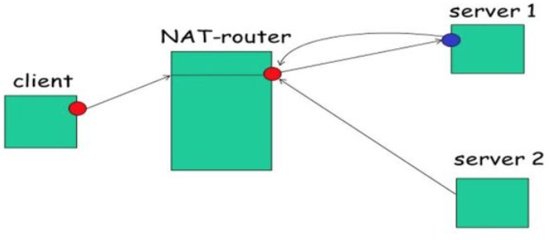
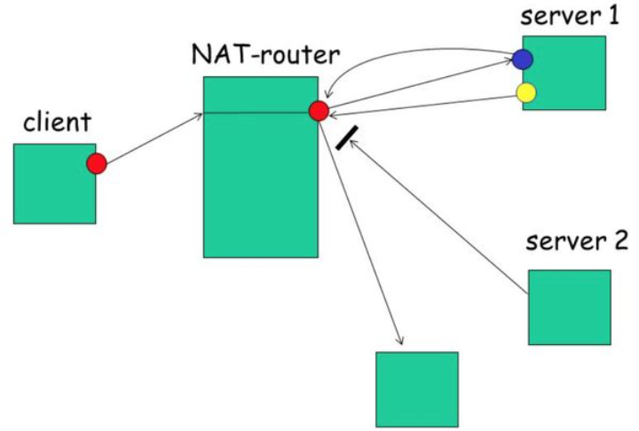
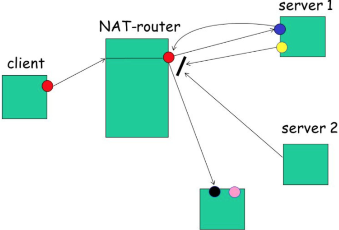
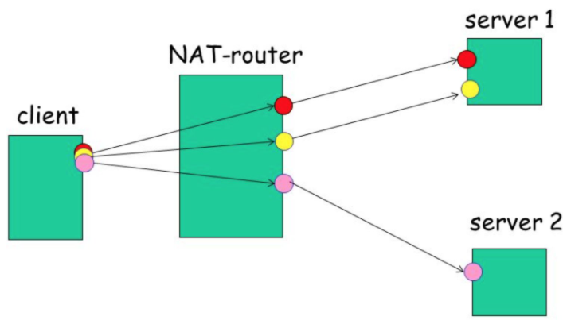
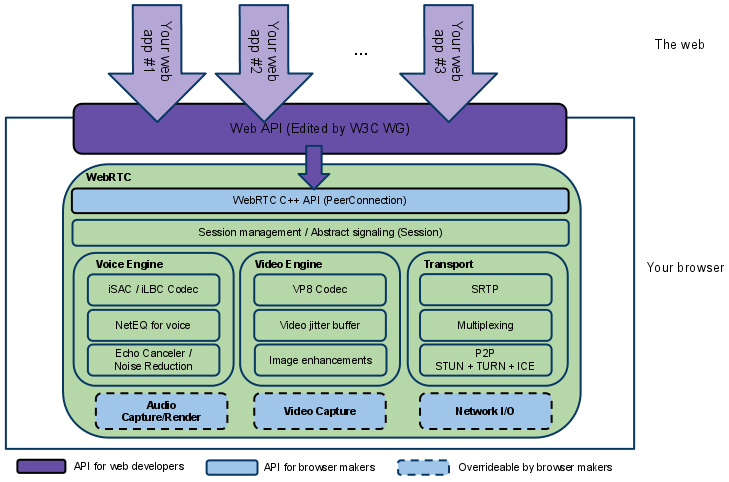
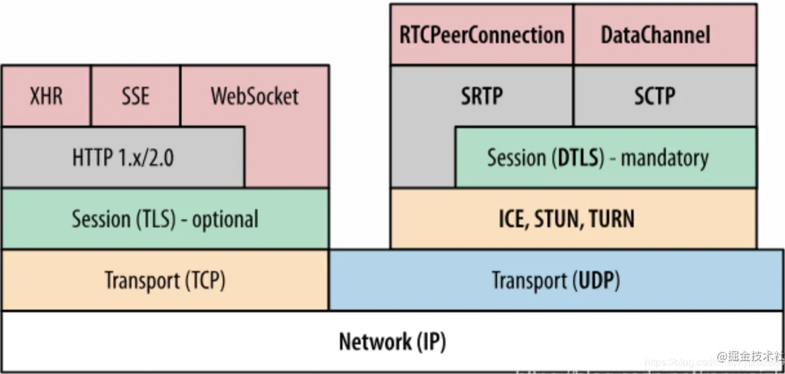
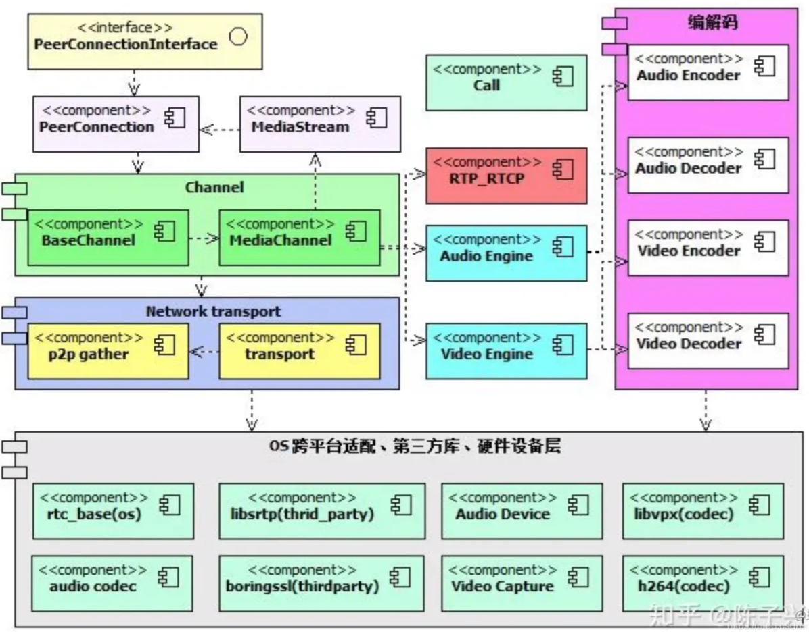

## ICE

交互式连接创建（Interactive Connectivity Establishment），一种综合性的NAT穿越的技术。

可集成各种NAT穿透技术，如STUN、TURN（Traversal Using Relay NAT，中继NAT实现的穿透）、RSIP（Realm Specific IP，特定域IP）等。该framework可以让SIP的客户端利用各种NAT穿透方式打穿远程的防火墙。

浏览器和对端浏览器建立连接的协议框架。

### NAT

网络地址转换协议[Network Address Translation (NAT)](http://en.wikipedia.org/wiki/NAT)

（私网）设备映射一个公网的IP地址的协议。

私网设备的IP被映射成路由器的公网IP和唯一的端口，通过这种方式不需要为每一个私网设备分配不同的公网IP，但是依然能被外网设备发现。

#### 完全圆锥形NAT

Full cone NAT(即一对一NAT): 一旦一个内部地址(iAddr:iPort)映射到外部地址(eAddr:ePort)，所有发自(iAddr:iPort)的包都经由(eAddr:ePort)向外发送。任意外部主机都能通过给(eAddr:ePort)发包到达(iAddr:iPort)。

同一个内部地址(iAddr:iPort)只会映射相同的外部地址(eAddr:ePort)，映射完成后，目标IP端口都无限制。

#### 受限圆锥形NAT

Address-Restricted cone NAT：内部客户端必须首先发送数据包到对方(IP=X.X.X.X)，然后才能接收来自(IP=X.X.X.X)的数据包。在限制方面，唯一的要求是数据包是来自(IP=X.X.X.X)。内部地址(iAddr:iPort)映射到外部地址(eAddr:ePort)，所有发自(iAddr:iPort)的包都经由(eAddr:ePort)向外发送。外部主机(hostAddr:any)能通过给(eAddr:ePort)发包到达(iAddr:iPort)。**注：any指外部主机源端口不受限制，只有发给NAT转换地址(eAddr:ePort)的数据包才被放行**

同一个内部地址(iAddr:iPort)只会映射相同的外部地址(eAddr:ePort)，映射完成后，必须先发一个包给目标，然后才能收到目标回发的包，目标端口无限制。

#### 端口受限圆锥形NAT

Port-Restricted cone NAT：类似受限制锥形NAT(Restricted cone NAT)，但是还有端口限制。一旦一个内部地址(iAddr:iPort)映射到外部地址(eAddr:ePort)，所有发自(iAddr:iPort)的包都经由(eAddr:ePort)向外发送。在受限圆锥型NAT基础上增加了外部主机源端口必须是固定的。

同一个内部地址(iAddr:iPort)只会映射相同的外部地址(eAddr:ePort)，映射完成后，必须先发一个包给目标(tAddr:tPort)，然后才能收到目标(tAddr:tPort)回发的包，有目标端口限制。

#### 对称NAT

Symmetric NAT：每一个来自相同内部IP与端口，到一个特定目的地地址和端口的请求，都映射到一个独特的外部IP地址和端口。同一内部IP与端口发到不同的目的地和端口的信息包，都使用不同的映射。只有曾经收到过内部主机数据的外部主机，才能够把数据包发回。

同一个内部地址(iAddr:iPort)对不同目标(tAddr1:tPort1)(tAddr2:tPort2)会映射出不同的外部地址(eAddr1:ePort1)(eAddr2:ePort2)，必须先发一个包给目标(iAddr:iPort)->(eAddr1:ePort1)->(tAddr1:tPort1)，才能收到回发的包(tAddr1:tPort1)->(eAddr1:ePort1)->(iAddr:iPort1)。

#### 简单的NAT穿透思路

NAT穿透，简单地讲就是要让处于不同NAT网络下的两个节点(Peer)建立直接连接，只知道自己的内网地址是肯定不行的，他们需要知道对方的公网IP和端口，然后双方互相向对方发送数据包，从而建立起连接。整个流程可以看做两个关键步骤：

1. **发现自己的公网IP和Port**
2. **将自己的IP和Port共享给对方**

第二步，我们可以简单地通过一个第三方服务器来交换双方的IP和Port，但是第一步就比较困难，我们不妨根据不同类型的NAT的特点，分别看看在不同的NAT类型下，怎样才能拿到一个可供通讯的公网IP和Port。

#### 不同NAT类型下的方案

下面方案介绍时，都假设要通讯的双方处于同一NAT类型下，不同类型下的NAT穿透方案，我相信各位读者在理解各个方案之后，自然就能类推出来。

##### 完全圆锥形 NAT

前面提过，完全锥形NAT下的节点(Client)只要建立起(iAddr:iPort)<->(eAddr:ePort)的映射关系之后，就能收到任何IP和端口发送的数据。所以基本思路如下：

1. 搭建一个具有公网IP和Port的服务(Server 1)
2. (Client)发送一个数据包给这个公网服务(Server1)
3. (Service1)通过解析IP协议包，就能得知(Client)的公网地址(eAddr:ePort)
4. (Server1)将该公网地址(eAddr:ePort)回传给(Client)
5. 两个不同的节点Client1和Client2通过第三方服务器交换公网地址(eAddr1:ePort1)(eAddr2:ePort2)
6. 自由地进行通讯

##### 受限圆锥形 NAT

受限圆锥形NAT获取自己公网地址的方式和上一步完全一致，但是因为受限圆锥形NAT需要先发送一个数据包之后才能收到目标传来的包。所以基本思路如下：

1. 搭建一个具有公网IP和Port的服务(Server 1)
2. (Client)发送一个数据包给这个公网服务(Server1)
3. (Service1)通过解析IP协议包，就能得知(Client)的公网地址(eAddr:ePort)
4. (Server1)将该公网地址(eAddr:ePort)回传给(Client)
5. 两个不同的节点Client1和Client2通过第三方服务器交换公网地址(eAddr1:ePort1)(eAddr2:ePort2)
6. 连接双方Client1和Client2先向对方地址发送一个数据包
7. 自由地进行通讯

##### 端口受限圆锥形 NAT

和受限圆锥形NAT完全一致。

##### 对称 NAT

因为对称型NAT对不同的目标(Server1)(Server2)会映射出不同的外网地址(eAddr1:ePort1)(eAddr2:ePort2)，也就是说，我们通过前面用到的公网服务(Server1),获取的公网地址(eAddr1:ePort1)，没办法共享给别人使用，他只能用来和(Server1)通讯。那我们不妨，将(Server1)作为一个代理，如果其他人想和(Client)进行通讯，可以通过(Server1)转发。基于这个思路，我们的做法如下：

1. 搭建一个具有公网IP和Port的服务(Server 1)
2. (Client)发送一个数据包给这个公网服务(Server1)
3. (Service1)通过解析IP协议包，就能得知(Client)的公网地址(eAddr:ePort)
4. (Server1)保存(Client)的公网地址(eAddr:ePort)，并生成一个代理地址(pAddr:pPort)
5. 凡是代理地址(pAddr:pPort)收到的数据都转发给Client的公网地址(eAddr:ePort)
6. (Service1)将Client的代理地址(pAddr:pPort)告知Client
7. 两个不同的节点Client1和Client2通过第三方服务器交换代理地址(pAddr1:pPort1)(pAddr2:pPort2)
8. 连接双方Client1和Client2先向对方的代理地址(pAddr1:pPort1)(pAddr2:pPort2)发送一个数据包
9. 双方通过代理地址(pAddr1:pPort1)(pAddr2:pPort2)进行通讯

理解了各个NAT类型下的解决简单方案之后，再来看STUN，TURN和ICE，你就会发现这三个协议负责的内容和上述的简单方案非常相似。

### STUN

NAT的会话穿越功能 [Session Traversal Utilities for NAT (STUN)](http://en.wikipedia.org/wiki/STUN)

允许位于NAT后的客户端**找出自己的公网地址**，判断出**路由器阻止直连的限制方法的协议**。

它允许位于NAT（或多重NAT）后的客户端找出自己的公网地址，查出自己位于哪种类型的NAT之后以及NAT为某一个本地端口所绑定的Internet端端口。这些信息被用来在两个同时处于NAT路由器之后的主机之间创建UDP通信。 

客户端通过给公网的STUN服务器发送请求**获得自己的公网地址信息**，以及是否能够被（穿过路由器）访问。

STUN负责的就是前面提到的Server1所做的内容。只不过STUN协议还具备另一个关键功能，就是确认Client的NAT类型（网络类型）。至于STUN是怎么获取Client公网地址这部分内容，我就不赘述了。接下来我会介绍一下STUN是如何确定Client的NAT类型（网络类型）的。

### TURN

一些路由器使用一种“对称型NAT”的NAT模型。这意味着路由器只接受和对端先前建立的连接（就是下一次请求建立新的连接映射）。

NAT的中继穿越方式 [Traversal Using Relays around NAT (TURN)](http://en.wikipedia.org/wiki/TURN) 通过TURN服务器中继所有数据的方式来绕过“对称型NAT”。

在TURN服务器上创建一个连接，然后告诉所有对端设备发包到服务器上，TURN服务器再把包转发。

TURN（全名Traversal Using Relay NAT），是一种数据传输协议（data-transfer protocol）。

允许在TCP或UDP的连接跨越NAT或防火墙。 TURN是一个client-server协议。TURN的NAT穿透方法与STUN类似，都是通过获取应用层中的公有地址达到NAT穿透。

但实现TURN client的终端必须在通信开始前与TURN server进行交互，并要求TURN server产生**"relay port"**，也就是relayed-transport-address。这时TURN server会创建peer，即远程端点（remote endpoints），开始进行中继（relay）的动作，TURN client利用relay port将数据发送至peer，再由peer转传到另一方的TURN client。

### SDP

会话描述协议[Session Description Protocol (SDP)](http://en.wikipedia.org/wiki/Session_Description_Protocol)

描述多媒体连接内容的协议，例如分辨率，格式，编码，加密算法等。

## [WebRTC 源码研究](https://juejin.cn/post/6844904199684096007)

### WebRTC 架构

WebRTC是为了解决 Web 端无法捕获音视频的能力，并且提供了 peer-to-peer（就是浏览器间）的视频交互。

根据最初的定义，WebRTC被指定为P2P（peer-to-peer）技术。

将以往的音视频技术一统江湖，融合在一起，做了一定的优化处理。它里面关于音视频处理的算法很多都可以抠出来用在不同场合。

虽然WebRTC最初被设想为纯粹的P2P技术，但许多日常业务应用程序需要集中式媒体功能，通过P2S（peer-to-server）架构提高可靠性、效率或扩展性。 对于P2P和P2S架构之间的问题对于构建WebRTC应用程序很重要。

- 总体上来说看上面图可以知道整个浅绿色部分都属于WebRTC核心架构层，它封装各种提供给web端使用的Web API层接口。
- 紫色的部分属于应用层，使用核心层提供的API。你可以在应用层扩展相关API，调用WebRTC核心层的接口。

WebRTC核心层又分为四层：

1. WebRTC C++ API (PeerConnection): 
   - 这层的API相对比较少，最主要就是实现P2P连接。
   - 在PeerConnection里面又包含了很多接口，如传输质量，传输质量报告，统计数据，各种流都是封装在PeerConnection模块里面。
   - 除此之外主要有音视频采集，音视频传输，非音视频数据传输等。
2. Session Management/ Abstract signaling (Session): 
   - 会话层，用来管理音视频，非音视频数据传输，处理相关逻辑。
3. 最核心的第三层，包含：
   - 音频引擎，视频引擎，传输，3大核心模块。
4. 最底层是与硬件相关的硬件适配层：
   - 这层包含：音频的采集和渲染，视频的捕捉，网络IO。
   - 注意到上图中底层的这个三个模块都是画的虚线，表示这些模块是可以自己去实现的，可以重载的，这样大大增加WebRTC的灵活性，为跨平台提供了基础。

WebRTC最核心的三大模块：Voice Engine, Video Engine , Transport，这三个层中Voice Engine只处理音频相关的技术，Video Engine处理视频相关的技术，音频和视频是相互独立的，一个重要的技术：**音视频同步并不包含**在这里面。

Voice Engine 音频引擎包含3大模块：

- **iSAC/iLBC Codec**: 这个模块主要是编解码，`iSAC/iLBC` 是jips公司开发的，另外有我们熟悉的音频`G711, G726,AAC， Opus` 目前使用的最多也是Opus,几年前AAC也是很火的，你可以自己把AAC模块加入到WebRTC里面.其中WebRTC中使用的是Opus,后面的会详细讲解这块的知识。
- **NetEQ for voice**: `NetEQ`实际上是一个音频缓冲的buffer,用于做网络的适配。如我们做防止音频抖动，这里面涉及了很多相关的算法。
- **Echo Canceler/ Noise Reduction**: 这里面解决了很多做音频头疼的问题：回音消除，降噪等问题处理算法。回音消除是困扰很多公司的一个头疼的技术，但WebRTC里面提供了非常成熟，稳定的回音消除算法，值得好好研究，应用到自己的产品中。其实很多算法工程师做的也是利用像WebRTC一样的开源代码，自己调一些参数，来提高音频质量。

Video Engine 视频引擎包含3大模块：

- **VP8 Codec**: 这块主要是视频编解码器，`VP8，VP9`都是google开发出来的，之前WebRTC最先支持的是自己家的VP8，后面也支持了`H264,H265， Open H264` , xh264(在官方的WebRTC里面是不支持的,如果你想支持可以自己安装Open H264的模块添加进去)
- **Video jitter buffer**:视频jitter buffer跟音频buffer一样也是用来防止视频抖动的。
- **Image enhancements**: 这块是图像处理相关的，如图像增强处理，WebRTC来说图像增强这一块做的比较薄。它把相应的接口也都留出来了，如果你想做一些美颜，贴图，滤镜处理，你也可以在提供的预留接口中去实现。像人脸视频这些接口都有，你都可以加入进去。

Transport 传输模块包含3大模块： 传输底层用的是UDP 协议，因为音视频传输对及时性要求更高，允许部分丢帧，WebRTC充分利用的UDP的不管控能力，利用各种成熟的算法保证高质量的音视频传输，可以自动适配码率变换。所有音视频的数据的发送，接收都是通过传输层去做的，从图中可以看出来，WebRTC的架构层次是非常清晰的。

- **SRTP**: 一般正常视频传输都是使用RTP协议，但是由于浏览器对安全性要求比较高，增加了加密这块的处理，采用SRTP协议。还有控制流的传输的协议RTCP，将相应的数据发送，接收报告发送给对方，这样对方就可以做流控处理。
- **Multplexing**:这里主要是多个流复用同一个通道。
- **P2P (STUN + TURN + ICE)** : 这里主要是P2P相关的技术，这是WebRTC**最核心的技术**，像以前做安防这块的P2P技术都是属于各个公司最核心的技术，现在WebRTC的源码这里面这块技术非常成熟，后面也会详细介绍这块打洞的技术。

整个传输层包括了对线路的检测，网络丢包，抖动，流控 ，NAT穿透打洞等等非常复查的技术都实现了非常成熟的方案。学好这块技术是非常有用的。

WebRTC传输层这块还实现了通过计算去估算你的网络带宽，不仅仅可以实现稳定的音视频传输，还可以传输其他非音视频数据，如文件，文本等二进制数据都可以传输。

需要注意的是，在WebRTC的核心层是没有视频的渲染的，视频的渲染需要应用层去做。

### Web API

面向第三方开发者的WebRTC标准API（Javascript），使开发者能够容易地开发出类似于网络视频聊天的web应用，这些API可分成`Network Stream API`、 `RTCPeerConnection`、`Peer-to-peer Data API`三类。[WebRTC 标准官方文档](https://link.juejin.cn/?target=https%3A%2F%2Fw3c.github.io%2Fwebrtc-pc%2F)

- Network Stream API

> 1. `MediaStream`：用来表示一个媒体数据流。
> 2. `MediaStreamTrack`: 在浏览器中表示一个媒体源。

- RTCPeerConnection

> 1. `RTCPeerConnection`: 一个RTCPeerConnection对象允许用户在两个浏览器之间直接通讯。
> 2. `RTCIceCandidate` ：表示一个ICE协议的候选者。
> 3. `RTCIceServer`:表示一个ICE Server。

- Peer-to-peer Data API

> 1. `DataChannel`:数据通道( DataChannel)接口表示一个在两个节点之间的双向的数据通道 。

### Transport / Session

`Session` 组件是基于[libjingle](https://link.juejin.cn/?target=https%3A%2F%2Fdevelopers.google.com%2Ftalk%2Flibjingle%2Fdeveloper_guide) （[会话协商 + NAT穿透组件库](https://link.juejin.cn/?target=https%3A%2F%2Fdevelopers.google.com%2Ftalk%2Flibjingle%2Fdeveloper_guide) ）开发 传输/会话层： 会话层组件采用了libjingle库的部分组件实现，无须使用xmpp/jingle协议

**RTP Stack协议栈**： Real Time Protocol

**P2P（ICE + STUN + TURN）**：用来实现点对点传输,可以用来建立不同类型网络间的呼叫连接。

**Session Management**：一个抽象的会话层，提供会话建立和管理功能。该层协议留给应用开发者自定义实现。

### VoiceEngine

音频引擎是包含一系列音频多媒体处理的框架，包括从视频采集卡到网络传输端等整个解决方案。 `VoiceEngine`是WebRTC极具价值的技术之一，是Google收购GIPS公司后开源的。在VoIP上，技术业界领先.

- **iSAC** : Internet Speech Audio Codec 针对VoIP和音频流的宽带和超宽带音频编解码器，是WebRTC音频引擎的默认的编解码器 采样频率：16khz，24khz，32khz；（默认为16khz） 自适应速率为10kbit/s ~ 52kbit/s； 自适应包大小：30~60ms； 算法延时：frame + 3ms
- **iLBC** : Internet Low Bitrate Codec VoIP音频流的窄带语音编解码器 采样频率：8khz； 20ms帧比特率为15.2kbps 30ms帧比特率为13.33kbps 标准由IETF RFC3951和RFC3952定义
- **NetEQ for Voice** : 针对音频软件实现的语音信号处理元件 NetEQ算法：自适应抖动控制算法以及语音包丢失隐藏算法。使其能够快速且高解析度地适应不断变化的网络环境，确保音质优美且缓冲延迟最小。 是GIPS公司独步天下的技术，能够有效的处理由于网络抖动和语音包丢失时候对语音质量产生的影响。 PS：NetEQ 也是WebRTC中一个极具价值的技术，对于提高VoIP质量有明显效果，加以AEC\NR\AGC等模块集成使用，效果更好。
- **Acoustic Echo Canceler (AEC)**: 回声消除器是一个基于软件的信号处理元件，能实时的去除mic采集到的回声。
- **Noise Reduction (NR)** : 噪声抑制也是一个基于软件的信号处理元件，用于消除与相关VoIP的某些类型的背景噪声（嘶嘶声，风扇噪音等等… …）

**WebRTC的音频部分，包含设备、编解码(iLIBC/iSAC/G722/PCM16/RED/AVT、NetEQ)、加密、声音文件、声音处理、声音输出、音量控制、音视频同步、网络传输与流控(RTP/RTCP)等功能。**

- **音频设备---audio_device** ： 源代码在`webrtc\modules\audio_device\main`目录下，包含接口和各个平台的源代码。在windows平台上，WebRTC采用的是Windows Core Audio和Windows Wave技术来管理音频设备，还提供了一个混音管理器。利用音频设备，可以实现声音输出，音量控制等功能。
- **音频编解码---audio_coding** ： 源代码在`webrtc\modules\audio_coding`目录下。WebRTC采用i`LIBC/iSAC/G722/PCM16/RED/AVT`编解码技术。WebRTC还提供NetEQ功能---抖动缓冲器及丢包补偿模块，能够提高音质，并把延迟减至最小。另外一个核心功能是基于语音会议的混音处理。
- **声音加密--voice_engine_encryption** ： 和视频一样，WebRTC也提供声音加密功能。声音文件该功能是可以用本地文件作为音频源，支持的格式有Pcm和Wav。 同样，WebRTC也可以录制音频到本地文件。
- **声音处理--audio_processing** ： 源代码在`webrtc\modules\audio_processing`目录下。声音处理针对音频数据进行处理，包括回声消除(`AEC`)、`AECM(AEC Mobile)`、自动增益(`AGC`)、降噪(`NS`)、静音检测(`VAD`)处理等功能，用来提升声音质量。
- **网络传输与流控** ： 和视频一样，WebRTC采用的是成熟的`RTP/RTCP`技术。

#### 音频、视频图像处理的主要数据结构

| 定义类型          | 头文件         | 简介                                                         | 路径 |
| ----------------- | -------------- | ------------------------------------------------------------ | ---- |
| Structures        | common_types.h | 列出VoiceEngine & VideoEngine常见的结构                      |      |
| Enumerators       | common_types.h | 列出VoiceEngine和VideoEngine通用的枚举数                     |      |
| Classes           | common_types.h | 列出VoiceEngine和VideoEngine常见的类                         |      |
| class VoiceEngine | voe_base.h     | 如何使用VoiceEngine类中的工厂方法为VoiceEngine分配和释放资源。它还列出了将文件跟踪和/或跟踪作为回调消息启用所需的api |      |
| class VideoEngine | vie_base.h     | 如何使用VideoEngine类中的工厂方法为VideoEngine分配和释放资源。它还列出了将文件跟踪和/或跟踪作为回调消息启用所需的api |      |

#### 音频引擎（VoiceEngine）模块 APIs

下表列的是目前在 `VoiceEngine`中可用的sub APIs

| 定义类型           | 头文件                 | 简介                                                         | 路径 |
| ------------------ | ---------------------- | ------------------------------------------------------------ | ---- |
| VoEAudioProcessing | voe_audio_processing.h | 增加对噪声抑制(NS)，自动增益控制(AGC)和回声控制(EC)的支持。也包括接收方VAD。 |      |
| VoEBase            | voe_base.h             | 启用全双工VoIP使用G.711。注意:必须始终创建此API              |      |
| VoECallReport      | voe_call_report.h      | 增加对呼叫报告的支持，该报告包含心跳检测的数量、RTT度量和Echo度量。 |      |
| VoECodec           | voe_codec.h            | 增加非默认编解码器(例如iLBC, iSAC, G.722等)，语音活动检测(VAD)支持。 |      |
| VoEDTMF            | voe_dtmf.h             | 增加电话事件传输，DTMF音频生成和电话事件检测。(电话事件包括DTMF。) |      |
| VoEEncryption      | voe_encryption.h       | 增加外部加密/解密支持扩展。                                  |      |
| VoEErrors          | voe_errors.h           | 声音引擎的错误代码                                           |      |
| VoEExternalMedia   | voe_external_media.h   | 添加对外部媒体处理的支持，并允许利用外部音频资源。           |      |
| VoEFile            | voe_file.h             | 添加文件回放、文件录制和文件转换功能。                       |      |
| VoEHardware        | voe_hardware.h         | 增加声音设备处理，CPU负载监控和设备信息功能。                |      |
| VoENetEqStats      | voe_neteq_stats.h      | 添加缓冲区统计功能。                                         |      |
| VoENetwork         | voe_network.h          | 增加外部传输，端口和地址过滤，窗口QoS支持和包超时通知。      |      |
| VoERTP_RTCP        | voe_rtp_rtcp.h         | 增加支持RTCP发送者报告，SSRC处理，RTP/RTCP统计，前向错误纠正(FEC)， RTCP应用，RTP捕获和RTP保持活着。 |      |
| VoEVideoSync       | voe_video_sync.h       | 添加RTP头修改支持，播放延迟调优和监控。                      |      |
| VoEVolumeControl   | voe_volume_control.h   | 添加扬声器音量控制、麦克风音量控制、静音支持和其他立体声缩放方法。 |      |

### VideoEngine

VideoEngine是WebRTC视频处理引擎 VideoEngine是包含一系列视频处理的整体框架，从摄像头采集视频到视频信息网络传输再到视频显示整个完整过程的解决方案。

- **VP8** 视频图像编解码器，是WebRTC视频引擎的默认的编解码器 VP8适合实时通信应用场景，因为它主要是针对低延时而设计的编解码器。 PS:VPx编解码器是Google收购ON2公司后开源的，VPx现在是WebM项目的一部分，而WebM项目是Google致力于推动的HTML5标准之一
- **Video Jitter Buffer** 视频抖动缓冲器，可以降低由于视频抖动和视频信息包丢失带来的不良影响。
- **Image enhancements** 图像质量增强模块 对网络摄像头采集到的图像进行处理，包括明暗度检测、颜色增强、降噪处理等功能，用来提升视频质量。

**WebRTC的视频部分，包含采集、编解码(I420/VP8)、加密、媒体文件、图像处理、显示、网络传输与流控(RTP/RTCP)等功能。**

- **视频采集---video_capture**： 源代码在`webrtc\modules\video_capture\main`目录下，包含接口和各个平台的源代码。在windows平台上，WebRTC采用的是dshow技术，来实现枚举视频的设备信息和视频数据的采集，这意味着可以支持大多数的视频采集设备；对那些需要单独驱动程序的视频采集卡（比如海康高清卡）就无能为力了。视频采集支持多种媒体类型，比如I420、YUY2、RGB、UYUY等，并可以进行帧大小和帧率控制。
- **视频编解码---video_coding**：源代码在`webrtc\modules\video_coding`目录下。WebRTC采用I420/VP8编解码技术。VP8是google收购ON2后的开源实现，并且也用在WebM项目中。VP8能以更少的数据提供更高质量的视频，特别适合视频会议这样的需求。
- **视频加密--video_engine_encryption** ： 视频加密是WebRTC的video_engine一部分，相当于视频应用层面的功能，给点对点的视频双方提供了数据上的安全保证，可以防止在Web上视频数据的泄漏。视频加密在发送端和接收端进行加解密视频数据，密钥由视频双方协商，代价是会影响视频数据处理的性能；也可以不使用视频加密功能，这样在性能上会好些。视频加密的数据源可能是原始的数据流，也可能是编码后的数据流。估计是编码后的数据流，这样加密代价会小一些。
- **视频媒体文件--media_file**：源代码在`webrtc\modules\media_file`目录下。该功能是可以用本地文件作为视频源，有点类似虚拟摄像头的功能；支持的格式有Avi。 另外，WebRTC还可以录制音视频到本地文件，比较实用的功能。
- **视频图像处理--video_processing** ： 源代码在`webrtc\modules\video_processing`目录下。视频图像处理针对每一帧的图像进行处理，包括明暗度检测、颜色增强、降噪处理等功能，用来提升视频质量。
- **视频显示--video_render**： 源代码在`webrtc\modules\video_render`目录下。在windows平台，WebRTC采用direct3d9和directdraw的方式来显示视频。在Mac平台采用metal来渲染视频，在移动端IOS，Android使用对应的Opengl es渲染。
- **网络传输与流控** ： 对于网络视频来讲，数据的传输与控制是核心价值。WebRTC采用的是成熟的`RTP/RTCP`技术。

#### 视频引擎（VideoEngine）模块 APIs

| 定义类型                 | 头文件               | 简介                                                         | 路径 |
| ------------------------ | -------------------- | ------------------------------------------------------------ | ---- |
| ViEBase                  | vie_base.h           | 创建VideoEngine实例、通道和VoiceEngine交互的基本功能。       |      |
| 注意:必须始终创建此API。 |                      |                                                              |      |
| ViECapture               | vie_capture.h        | 添加对捕获设备分配以及捕获设备功能的支持。                   |      |
| ViECodec                 | vie_codec.h          | 增加非默认编解码器，编解码器设置和包丢失功能。               |      |
| ViEEncryption            | vie_encryption.h     | 增加外部加密/解密支持。                                      |      |
| ViEErrors                | vie_errors.h         | 视频引擎的错误代码                                           |      |
| ViEExternalCodec         | vie_external_codec.h | 增加了对使用外部编解码器的支持。                             |      |
| ViEFile                  | vie_file.h           | 增加对文件记录，文件播放，背景图像和快照的支持               |      |
| ViEImageProcess          | vie_image_process.h  | 增加效果滤镜，缩小，去噪和色彩增强。                         |      |
| ViENetwork               | vie_network.h        | 增加发送和接收功能，外部传输，端口和地址过滤，窗口QoS支持，包超时通知和改变网络设置。 |      |
| ViERender                | vie_render.h         | 增加了渲染功能。                                             |      |
| ViERTP_RTCP              | vie_rtp_rtcp.h       | 处理RTP/RTCP统计，NACK/FEC，保持活动功能和关键帧请求方法。   |      |
|                          |                      |                                                              |      |

### webrtc源码结构

如果按照通常层次化的思维来组织，从下到上，大概分以下几个层次：

- **OS 跨平台适配、硬件设备访问、第三方库 Wrapper 层**： 包括网络层、操作系统 API 的跨平台封装，音频设备、视频设备封装，音频、视频 codec，DTLS 的第三方实现等。
- **网络传输层**： 这里包括 candidate 收集，stun/turn 协议的实现，dtls、rtp 网络连接的建立，sctp 连接的建立等。
- **通道层**： 主要包含传输通道也就是 BaseChannel 层 和 媒体通道 也就是 MediaChannel 层。BaseChannel 是和 PeerConnection、Transport 层对接。MediaChannel 实现其实在音视频引擎里面，是 BaseChannel 和引擎的桥梁。
- **RTP_RTCP** ： 主要是流控
- **Audio Engine、Video Engine 是音视频引擎层**，音视频处理。
- **音视频编解码器**，这也是 WebRTC 自己的一个抽象，真正的编解码库还是依赖第三方库。
- **PeerConnection、MediaStream** 主要是对 jsep 协议的实现。
- **PeerConnectionInterface** 是一个对外抽象接口类设计。

| 目录名          | 模块内容                                                     | 简介 | 路径 |
| --------------- | ------------------------------------------------------------ | ---- | ---- |
| api             | 提供了对外的接口，音视频引擎层和 Module 直接的接口。         | --   | --   |
| audio           | 音频流的一部分抽象，属于引擎的一部分逻辑。                   | --   | --   |
| base            | 这一部分还没有学习到，属于 Chromium 项目的一部分，貌似 WebRTC 中用的并不多。 | --   | --   |
| build           | 编译脚本。这里需要注意的是，不同平台的代码在下载的时候，获取的工具集是不一样的。 | --   | --   |
| build_overrides | 编译工具。                                                   | --   | --   |
| buildtools      | 编译工具链。                                                 | --   | --   |
| call            | 主要是媒体流的接口抽象。为媒体引擎和 codec 层提供桥接。这里说的媒体流是 RTP 流。pc 层也抽象了媒体流，那是编码前、或者解码后。 | --   | --   |
| common_audio    | 音频算法实现，比如 fft。                                     | --   | --   |
| common_video    | 视频算法实现，比如 h264 协议格式。                           | --   | --   |
| data            | 测试数据                                                     | --   | --   |
| examples        | WebRTC 使用的例子。提供了 peerconnection_client、peerconnection_server、stun、turn 的 demo。 | --   | --   |
| help            | 帮助信息。                                                   | --   | --   |
| infra           | 工具。                                                       | --   | --   |
| logging         | WebRTC 的 log 库。                                           | --   | --   |
| media           | 媒体引擎层，包括音频、视频引擎实现。                         | --   | --   |
| modules         | WebRTC 把一些逻辑比较独立的抽象为 Module，利于扩展维护。     | --   | --   |
| ortc            | 媒体描述协议，类似 sdp 协议。                                | --   | --   |
| out             | build 输出目录，这是 webrtc 官方编译指导中示范目录。         | --   | --   |
| p2p             | 主要是实现 candidate 收集，NAT 穿越。                        | --   | --   |
| pc              | 实现 jsep 协议。                                             | --   | --   |
| resources       | 测试数据                                                     | --   | --   |
| rtc_base        | 包括 Socket、线程、锁等 OS 基础功能实现。                    | --   | --   |
| rtc_tools       | 网络监测工具、音视频分析工具。很多工具都是脚本实现。         | --   | --   |
| sdk             | 主要是移动端相关实现。                                       | --   | --   |
| stats           | WebRTC 统计模块实现。                                        | --   | --   |
| style-guide     | 编码规范说明                                                 | --   | --   |
| system_wrappers | OS 相关功能的封装，比如 cpu、clock 等。                      | --   | --   |
| test            | 单元测试代码实现，用 gmock                                   | --   | --   |
| testing         | gmock、gtest等源码，属于整个 Chromium 项目。                 | --   | --   |
| third_party     | 第三方库依赖。比如，boringssl，abseil-cpp，libvpx等          | --   | --   |
| tools           | 公共工具集，整个 Chromium 项目依赖的。                       | --   | --   |
| tools_webrtc    | WebRTC 用到的工具集。比如代码检查 valgrind 的使用。          | --   | --   |
| video           | 视频 RTP 流的抽象接口，属于视频引擎的一部分。                | --   | --   |

### 核心模块

#### PeerConnection

PeerConnection 的主要实现逻辑就是在 WebRTC 源码的 pc 目录下。

一切都从 PeerConnectionFactory 和 PeerConnection 开始，对外提供 PeerConnectionFactoryInterface 和 PeerConnectionInterface 两个接口类。Factory 类，顾名思义就是创建 PeerConnection 的，下来我们只讨论 PeerConnection。

也许你已经非常熟悉 WebRTC 的 JavaScript 接口。比如，RTCPeerConnection，setLocalDescription、setRemoteDescription、createOffer、createAnswer 等，没错这些。JavaScript 接口的 Native 实现就是在 PeerConnection 中完成的，它也有对应的一套接口。JavaScript 这套接口实现规范是JSEP。 可以说是把这套规范的模型都给实现了。

WebRTC 终端之间的通信协议是 ICE 协议，书包格式采用 SDP 协议。PeerConnection 实现了 SessionDescription 的逻辑。

PeerConnection 抽象了 RtpTransceiver，RtpSender、RtpReceiver 模型，对应了 sdp 中描述的媒体的实现。

#### Module

WebRTC 将逻辑功能独立、内聚性、复用性强的部分单独抽象为模块。模块在 WebRTC 源码的 modules 目录下，主要是音视频设备、codec、流控等。

#### libjingle

WebRTC重用了libjingle的一些组件，主要是network和transport组件

### 书籍

- [《WebRTC权威指南》](https://link.juejin.cn/?target=https%3A%2F%2Fwww.amazon.cn%2Fdp%2FB01L6C5Y6U%2Fref%3Dsr_1_1%3Fie%3DUTF8%26qid%3D1519291362%26sr%3D8-1%26keywords%3Dwebrtc): 本书适用于初学者，可以快速理解WebRTC相关的理论知识。
- [《Learning WebRTC》 中文版](https://link.juejin.cn/?target=https%3A%2F%2Fwww.amazon.cn%2Fdp%2FB071S5LNT1%2Fref%3Dpd_sbs_351_1%2F457-3549923-6513334%3F_encoding%3DUTF8%26pd_rd_i%3DB071S5LNT1%26pd_rd_r%3D3aa2ea99-1df2-4452-b873-1bebe3b42a01%26pd_rd_w%3Df8bP5%26pd_rd_wg%3DT33hB%26pf_rd_p%3D5bb179b2-ff44-431e-a8ee-d606fb63c2c9%26pf_rd_r%3DBXY5W27EKTSZVRT1HSRC%26psc%3D1%26refRID%3DBXY5W27EKTSZVRT1HSRC):对于前端开发人员是一个很好的入门书籍。对相关传输层的开发介绍需要读者参考更多相关资料。
- [《Getting Started with webrtc》 英文版](https://link.juejin.cn/?target=https%3A%2F%2Fwww.amazon.cn%2Fdp%2FB00FF8OJZE%2Fref%3Dsr_1_6%3Fie%3DUTF8%26qid%3D1519291362%26sr%3D8-6%26keywords%3Dwebrtc):
- [《直播系统开发》](https://link.juejin.cn/?target=https%3A%2F%2Fwww.amazon.cn%2Fdp%2FB07NW9R2FV%2Fref%3Dpd_sim_351_3%2F457-3549923-6513334%3F_encoding%3DUTF8%26pd_rd_i%3DB07NW9R2FV%26pd_rd_r%3D384e1c91-c02a-402e-a6ca-9ec8bc3e4606%26pd_rd_w%3DmxTCX%26pd_rd_wg%3D1pvUl%26pf_rd_p%3D7ed9834e-1f9f-4a98-9257-6a91ef62505c%26pf_rd_r%3DK0DK05B9CDZTYHYC31R9%26psc%3D1%26refRID%3DK0DK05B9CDZTYHYC31R9):
- [《WebRTC Cookbook》](https://link.juejin.cn/?target=https%3A%2F%2Fwww.amazon.cn%2Fdp%2FB00U1D9WR8%2Fref%3Dpd_sbs_351_2%2F457-3549923-6513334%3F_encoding%3DUTF8%26pd_rd_i%3DB00U1D9WR8%26pd_rd_r%3D3aa2ea99-1df2-4452-b873-1bebe3b42a01%26pd_rd_w%3Df8bP5%26pd_rd_wg%3DT33hB%26pf_rd_p%3D5bb179b2-ff44-431e-a8ee-d606fb63c2c9%26pf_rd_r%3DBXY5W27EKTSZVRT1HSRC%26psc%3D1%26refRID%3DBXY5W27EKTSZVRT1HSRC):
- [《Real-Time Communication with WebRTC: Peer-to-Peer in the Browser 》](https://link.juejin.cn/?target=https%3A%2F%2Fwww.amazon.cn%2Fdp%2FB00JQOL0QE%2Fref%3Dpd_sbs_351_2%2F457-3549923-6513334%3F_encoding%3DUTF8%26pd_rd_i%3DB00JQOL0QE%26pd_rd_r%3Dd7f9498d-7dbc-4140-b1d1-d9a6b241ec43%26pd_rd_w%3D2e5Uq%26pd_rd_wg%3DrIa4b%26pf_rd_p%3D5bb179b2-ff44-431e-a8ee-d606fb63c2c9%26pf_rd_r%3DN63TG8S0QVEJJWEKE3EY%26psc%3D1%26refRID%3DN63TG8S0QVEJJWEKE3EY):
- [《Handbook of SDP for Multimedia Session Negotiations: SIP and WebRTC IP Telephony》](https://link.juejin.cn/?target=https%3A%2F%2Fwww.amazon.cn%2Fdp%2FB07NSF569P%2Fref%3Dpd_sbs_351_3%2F457-3549923-6513334%3F_encoding%3DUTF8%26pd_rd_i%3DB07NSF569P%26pd_rd_r%3D0403a68d-36f0-4d98-b843-a83a23dc0157%26pd_rd_w%3DbCfhg%26pd_rd_wg%3DAWiqQ%26pf_rd_p%3D5bb179b2-ff44-431e-a8ee-d606fb63c2c9%26pf_rd_r%3DZVERGY6G3VKCKBX7YFAJ%26psc%3D1%26refRID%3DZVERGY6G3VKCKBX7YFAJ)：
- [《WebRTC Blueprints (English Edition)》](https://link.juejin.cn/?target=https%3A%2F%2Fwww.amazon.cn%2Fdp%2FB00KD9NI1Q%2Fref%3Dpd_sbs_351_4%2F457-3549923-6513334%3F_encoding%3DUTF8%26pd_rd_i%3DB00KD9NI1Q%26pd_rd_r%3D3aa2ea99-1df2-4452-b873-1bebe3b42a01%26pd_rd_w%3Df8bP5%26pd_rd_wg%3DT33hB%26pf_rd_p%3D5bb179b2-ff44-431e-a8ee-d606fb63c2c9%26pf_rd_r%3DBXY5W27EKTSZVRT1HSRC%26psc%3D1%26refRID%3DBXY5W27EKTSZVRT1HSRC)：

### 大神博客

- [基于 WebRTC 的云游戏开源项目](https://link.juejin.cn/?target=https%3A%2F%2Fwebrtc.org.cn%2F20200421-cloudgaming1%2F)
- [WebRTC STUN/TURN 服务器的部署](https://link.juejin.cn/?target=http%3A%2F%2Fpiratefsh.github.io%2Fprojects%2F2015%2F08%2F27%2Fwebrtc-stun-turn-servers.html)
- [WebRTC 入门](https://link.juejin.cn/?target=https%3A%2F%2Fhpbn.co%2Fwebrtc%2F)

### Demo实例代码

下面几个是WebRTC开发者社区的：

- [STUN服务器与客户端](https://link.juejin.cn?target=https%3A%2F%2Fsourceforge.net%2Fprojects%2Fstun%2F):这个项目在Windows、Linux和Solaris上实现了一个简单的STUN服务器和客户机。STUN协议(通过NATs简单遍历UDP)在IETF RFC 3489中描述，可在http://www.ietf.org/rfc/rfc3489.txt获得
- [Mac端实现的Framework一个Demo](https://link.juejin.cn?target=https%3A%2F%2Fgithub.com%2FDSPerson%2FWebRTCMacFramework)：
- [WebRtcRoom Server](https://link.juejin.cn?target=https%3A%2F%2Fgithub.com%2Fqdgx%2FWebRtcRoomServer):使用Node js开发，信令服务器使用 [Socket.IO](https://link.juejin.cn?target=https%3A%2F%2Fsocket.io) ，[Android](https://link.juejin.cn?target=https%3A%2F%2Fgithub.com%2Fqdgx%2FWebRtcRoomAndroid)，[iOS](https://link.juejin.cn?target=https%3A%2F%2Fgithub.com%2Fqdgx%2FWebRtcRoomIOS)，[Html](https://link.juejin.cn?target=https%3A%2F%2Fgithub.com%2Fqdgx%2FWebRtcRoomHtml)，[Server](https://link.juejin.cn?target=https%3A%2F%2Fgithub.com%2Fqdgx%2FWebRtcRoomServer)均做了实现

几个跨平台开发中可用的 WebRTC Demo:

- [Flutter + WebRTC Demo](https://link.juejin.cn?target=https%3A%2F%2Fgithub.com%2Fcloudwebrtc%2Fflutter-webrtc):Flutter WebRTC plugin ，支持 iOS、Android。 有比较高的星星哦。
- [React Native + Webrtc Demo](https://link.juejin.cn?target=https%3A%2F%2Fgithub.com%2Freact-native-webrtc%2Freact-native-webrtc%23creator):一个 React Native 的 WebRTC module , 支持 iOS 和Android平台；支持Video / Audio / Data Channels.. 有不错的星星数2.8k

- Xamarin + WebRTC

   : 一个基于 WebRTC 的 iOS 视频通话 App，通过 Xamarin 开发. 这个作者本身是微软 Xamarin 团队的. 目前星星数量不多。使用Xamarin的基于WebRTC的本地iOS视频聊天应用。

[webrtc-uwp PeerCC-Sample](https://link.juejin.cn?target=https%3A%2F%2Fgithub.com%2Fwebrtc-uwp%2FPeerCC-Sample):这个例子实现的是WebRTC UWP（Universal Windows Platform） App 包含PeerConnection示例WebRTC示例，用于在两个对等点之间建立音频/视频调用。它包括一个预编译的信号服务器，并引用了WebRTC UWP NuGet包，这使它成为在UWP上启动和运行WebRTC的最快方式。这个示例还包括Unity支持以及针对HoloLens和混合现实开发的特性。对于引用完整的WebRTC UWP源代码而不是NuGet包的相同示例，请参见https://github.com/webrtc-uwp/PeerCC。它基于https://webrtc.org的原始PeerConnection示例。

- [RTCStartupDemo](https://link.juejin.cn?target=https%3A%2F%2Fgithub.com%2FJhuster%2FRTCStartupDemo) ：一套超级简单的信令服务器，以及配套的完全基于 WebRTC 官方 API 的客户端 demo 示例代码（含：Web/Android/iOS/Windows 全平台）。这是一个针对[webrtc](https://link.juejin.cn?target=https%3A%2F%2Fwebrtc.org)初学者的启动演示，包括一个基于[socket.io](https://link.juejin.cn?target=https%3A%2F%2Fsocket.io)套接字的简单信号服务器和一些客户端在Web/Android/iOS/Windows平台上演示。
- [meething-ml-camera](https://link.juejin.cn?target=https%3A%2F%2Fgithub.com%2Fmeething%2Fmeething-ml-camera) :为基于 Web 的视频通话，通过机器学习生成虚拟形象

- [ShareDrop](https://link.juejin.cn?target=https%3A%2F%2Fgithub.com%2Fcowbell%2Fsharedrop) : 一个基于 WebRTC 实现的 HTML5 版 Airdrop，可用于用户点对点传输文件。在这个项目中，用到了 WebRTC peer-to-peer 文件传输、WebRTC 信令，以及 [Firebase ](https://link.juejin.cn?target=https%3A%2F%2Fwww.firebase.com).

> 1. ShareDrop是一个受苹果AirDrop服务启发的web应用程序。它允许你直接在设备之间传输文件，而不需要先将它们上传到任何服务器。它使用WebRTC进行安全点对点文件传输，使用Firebase进行存在管理和WebRTC信号发送。
> 2. ShareDrop允许你在没有任何配置的情况下将文件发送到同一本地网络中的其他设备(即具有相同公共IP地址的设备)——只需在所有设备上打开https://www.sharedrop.io，它们就会互相看到。它还允许你在网络之间发送文件——只需点击页面右上角的+按钮，就可以创建一个拥有独特URL的房间，并与你想要发送文件的其他人分享这个URL。一旦他们在自己设备的浏览器中打开这个页面，你就会看到彼此的头像。
> 3. ShareDrop和AirDrop的主要区别在于，ShareDrop需要互联网连接才能发现其他设备，而AirDrop则不需要——它在这些设备之间创建特别的无线网络。另一方面，ShareDrop允许你在移动设备(Android)和桌面设备之间以及网络之间共享文件。

- 声网 Agora Web Demo :

> 1. [Agora Web TypeScript SDK ](https://link.juejin.cn?target=https%3A%2F%2Fagoraio-community.github.io%2FAgoraWebSDK-NG%2Fzh-CN%2F)
> 2. [Web 端 Agora 在线教育场景 Demo ](https://link.juejin.cn?target=https%3A%2F%2Frtcdeveloper.com%2Ft%2Ftopic%2F16972)
> 3. [Web 端1对1视频通话 Demo ](https://link.juejin.cn?target=https%3A%2F%2Frtcdeveloper.com%2Ft%2Ftopic%2F611)
> 4. [Web端多人视频通话Demo ](https://link.juejin.cn?target=https%3A%2F%2Frtcdeveloper.com%2Ft%2Ftopic%2F15011)
> 5. [Web端集成 Agora 视频 SDK，视频音频自采集 ](https://link.juejin.cn?target=https%3A%2F%2Frtcdeveloper.com%2Ft%2Ftopic%2F17336)
> 6. [Web端实现屏幕共享Demo ](https://link.juejin.cn?target=https%3A%2F%2Frtcdeveloper.com%2Ft%2Ftopic%2F17337)
> 7. [Web端基于Agora实时消息SDK发消息Demo ](https://link.juejin.cn?target=https%3A%2F%2Frtcdeveloper.com%2Ft%2Ftopic%2F17361)
> 8. [Web端快速集成 Agora 视频 SDK，实现17人视频直播 ](https://link.juejin.cn?target=https%3A%2F%2Frtcdeveloper.com%2Ft%2Ftopic%2F17338)
> 9. [Web端实现浏览器远程控制桌面的 Demo ](https://link.juejin.cn?target=https%3A%2F%2Frtcdeveloper.com%2Ft%2Ftopic%2F17339)

参考：[webrtc音视频开发总结——架构分析](https://link.juejin.cn?target=https%3A%2F%2Fwww.jianshu.com%2Fp%2F1fb7702f4b85)

## Signaling and video calling

### SD

WebRTC连接上的端点配置称为**会话描述**。

 该描述包括关于要发送的媒体类型，其格式，正在使用的传输协议，端点的IP地址和端口以及描述媒体传输端点所需的其他信息的信息。 使用**会话描述协议**([SDP](https://developer.mozilla.org/zh-CN/docs/Glossary/SDP))来交换和存储该信息。

- 当用户对另一个用户启动WebRTC调用时，将创建一个称为**提议**(offer)的特定描述。该描述包括有关呼叫者建议的呼叫配置的所有信息。 
- 接收者然后用**应答**(answer)进行响应，这是他们对呼叫结束的描述。
- 以这种方式，两个设备彼此共享以便交换媒体数据所需的信息。 该交换是使用交互式连接建立(ICE)([ICE](https://developer.mozilla.org/zh-CN/docs/Glossary/ICE)处理的，这是一种协议，即使两个设备通过网络地址转换([NAT](https://developer.mozilla.org/zh-CN/docs/Glossary/NAT))。

每个对等端保持两个描述：描述本身的**本地描述**和描述呼叫的远端的**远程描述**。

在首次建立呼叫时，还可以在呼叫格式或其他配置需要更改的任何时候执行提议/应答过程。 无论是新呼叫还是重新配置现有的呼叫，这些都是交换提议和回答所必需的基本步骤，暂时忽略了ICE层：

1. 呼叫者通过 [`navigator.mediaDevices.getUserMedia()` (en-US)](https://developer.mozilla.org/en-US/docs/Web/API/MediaDevices/getUserMedia) 捕捉本地媒体。
2. 呼叫者创建一个`RTCPeerConnection` 并调用 [`RTCPeerConnection.addTrack()`](https://developer.mozilla.org/zh-CN/docs/Web/API/RTCPeerConnection/addTrack) (注： `addStream` 已经过时。)
3. 呼叫者调用 [`RTCPeerConnection.createOffer()`](https://developer.mozilla.org/zh-CN/docs/Web/API/RTCPeerConnection/createOffer) 来创建一个提议(offer).
4. 呼叫者调用 [`RTCPeerConnection.setLocalDescription()` (en-US)](https://developer.mozilla.org/en-US/docs/Web/API/RTCPeerConnection/setLocalDescription) 将提议(Offer) 设置为本地描述 (即，连接的本地描述).
5. setLocalDescription()之后, 呼叫者请求 STUN 服务创建ice候选(ice candidates)
6. 呼叫者通过信令服务器将提议(offer)传递至 本次呼叫的预期的接受者.
7. 接受者收到了提议(offer) 并调用 [`RTCPeerConnection.setRemoteDescription()`](https://developer.mozilla.org/zh-CN/docs/Web/API/RTCPeerConnection/setRemoteDescription) 将其记录为远程描述 (也就是连接的另一端的描述).
8. 接受者做一些可能需要的步骤结束本次呼叫：捕获本地媒体，然后通过[`RTCPeerConnection.addTrack()`](https://developer.mozilla.org/zh-CN/docs/Web/API/RTCPeerConnection/addTrack)添加到连接中。
9. 接受者通过 [`RTCPeerConnection.createAnswer()` (en-US)](https://developer.mozilla.org/en-US/docs/Web/API/RTCPeerConnection/createAnswer) 创建一个应答。
10. 接受者调用 [`RTCPeerConnection.setLocalDescription()` (en-US)](https://developer.mozilla.org/en-US/docs/Web/API/RTCPeerConnection/setLocalDescription) 将应答(answer)  设置为本地描述. 此时，接受者已经获知连接双方的配置了.
11. 接受者通过信令服务器将应答传递到呼叫者.
12. 呼叫者接受到应答.
13. 呼叫者调用 [`RTCPeerConnection.setRemoteDescription()`](https://developer.mozilla.org/zh-CN/docs/Web/API/RTCPeerConnection/setRemoteDescription) 将应答设定为远程描述. 如此，呼叫者已经获知连接双方的配置了.
